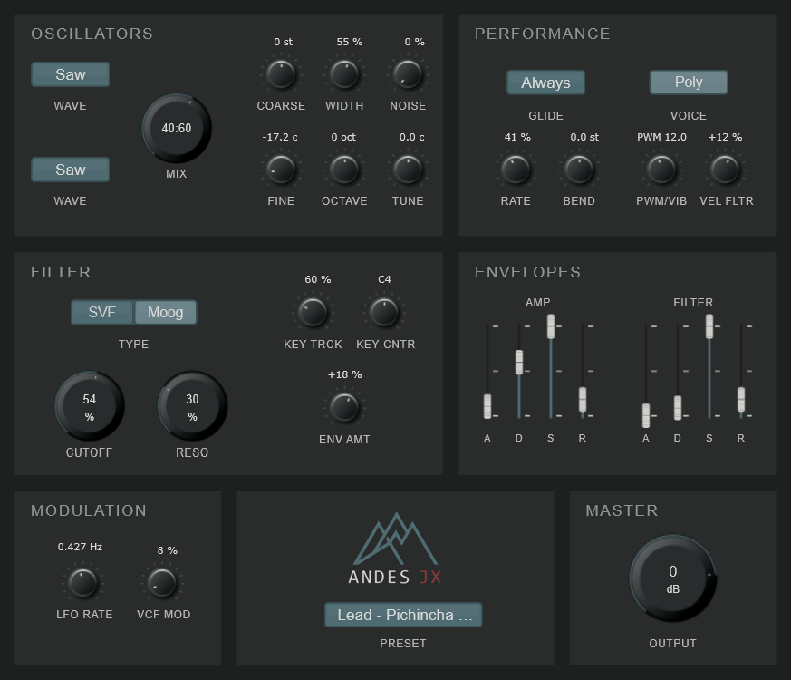

<div align="center">

# 🎹 Andes JX

## User Manual

**Polyphonic subtractive synthesizer**
*Synthesis from latitude zero*

**Version 1.0** · **May 2026**

---

By **NoiseRoomUIO**
Quito, Ecuador

[github.com/bansky0/Andes-JX](https://github.com/bansky0/Andes-JX) · [@noiseroom.uio](https://www.instagram.com/noiseroom.uio/)

</div>

---

<div align="center">

*A polyphonic subtractive synthesizer built in C++ with JUCE,*
*inspired by the Andean geography of Ecuador.*

</div>

---

## Table of contents

### Part 1 — Foundations

1. [Introduction](#1-introduction)
2. [Instrument concept](#2-instrument-concept)
3. [Installation and first steps](#3-installation-and-first-steps)
4. [Interface overview](#4-interface-overview)

### Part 2 — Practice

5. [Synthesis engine](#5-synthesis-engine)
   - 5.1 [Oscillators](#51-oscillators)
   - 5.2 [Filter](#52-filter)
   - 5.3 [Envelopes](#53-envelopes)
   - 5.4 [Modulation](#54-modulation)
   - 5.5 [Performance](#55-performance)
   - 5.6 [Master](#56-master)
   - 5.7 [Presets system](#57-presets-system)
6. [Sound design tutorials](#6-sound-design-tutorials)
   - 6.1 [Tutorial 1 — Bass: Cotacachi Ostinato](#61-tutorial-1--bass-cotacachi-ostinato)
   - 6.2 [Tutorial 2 — Pad: Cayambe 5th](#62-tutorial-2--pad-cayambe-5th)
   - 6.3 [Tutorial 3 — Lead: Cotopaxi Acid](#63-tutorial-3--lead-cotopaxi-acid)
7. [Sound design techniques](#7-sound-design-techniques)
   - 7.1 [Working with the filter](#71-working-with-the-filter)
   - 7.2 [Interesting modulation](#72-interesting-modulation)
   - 7.3 [Internal movement](#73-internal-movement)

### Part 3 — Reference

8. [Learning DSP with Andes JX](#8-learning-dsp-with-andes-jx)
   - 8.1 [What you need to start](#81-what-you-need-to-start)
   - 8.2 [The architecture in three layers](#82-the-architecture-in-three-layers)
   - 8.3 [Key files to study](#83-key-files-to-study)
   - 8.4 [Suggested study paths](#84-suggested-study-paths)
   - 8.5 [How parameters connect to the algorithm](#85-how-parameters-connect-to-the-algorithm)
   - 8.6 [Where the academic references live in the code](#86-where-the-academic-references-live-in-the-code)
   - 8.7 [A note on the bilingual documentation](#87-a-note-on-the-bilingual-documentation)
9. [Preset bank](#9-preset-bank)
   - 9.1 [Init](#91-init)
   - 9.2 [Bass family](#92-bass-family-7-presets)
   - 9.3 [Pad family](#93-pad-family-6-presets)
   - 9.4 [Lead family](#94-lead-family-6-presets)
   - 9.5 [Brass / Wind / Organ family](#95-brass--wind--organ-family-6-presets)
   - 9.6 [Keys / Pluck / FX family](#96-keys--pluck--fx-family-8-presets)
10. [Troubleshooting and FAQ](#10-troubleshooting-and-faq)
    - 10.1 [Generic plugin issues](#101-generic-plugin-issues)
    - 10.2 [Andes JX specific questions](#102-andes-jx-specific-questions)
11. [Glossary](#11-glossary)
12. [Credits and references](#12-credits-and-references)
    - 12.1 [Andes JX team](#121-andes-jx-team)
    - 12.2 [This manual](#122-this-manual)
    - 12.3 [Acknowledgments](#123-acknowledgments)
    - 12.4 [References](#124-references)
    - 12.5 [License and distribution](#125-license-and-distribution)
    - 12.6 [Contact and support](#126-contact-and-support)

---

## 1. Introduction

### What is Andes JX?

Andes JX is a polyphonic subtractive synthesizer plugin (VST3) developed by NoiseRoomUIO in Quito, Ecuador. It combines two anti-aliased oscillators, two switchable filter models (a transparent state-variable filter and a non-linear Moog ladder), independent ADSR envelopes for amplitude and filter, a global LFO for modulation, and a bank of 33 factory presets organized by sound family.

The instrument's design draws on the warmth and character of classic analog synthesizers while introducing a sonic and visual identity rooted in the Andean geography of Ecuador. Preset names, color palette and overall aesthetic reference real places: volcanoes, snow-capped peaks, high-altitude lakes, paramos.

Andes JX is also an **open-source educational project**. Its complete source code is published under GPL v3 and documented bilingually (English and Spanish), so it can be studied as a reference for learning DSP and audio plugin development. This dual nature — production tool and learning resource — runs through every aspect of the instrument.

### Who is this manual for?

This manual is written for music producers and sound designers who already have basic familiarity with subtractive synthesis: you know what an oscillator, an envelope and a filter do in general terms, and you have used at least one other software synthesizer before.

If you are completely new to synthesis, the manual will still make sense, but you may find it useful to keep a synthesis primer at hand for some of the deeper concepts. A short [glossary](#11-glossary) at the end of this manual covers the most important terms.

If you are an experienced sound designer or DSP developer, you will find practical information here for using Andes JX as an instrument; for the technical depth of the implementation itself, the project's source code is a recommended reference.

### How to use this manual

The manual is structured in three parts:

1. **Foundations** (sections 1-4) — what Andes JX is, what it sounds like, how to install it and what each part of the interface does.
2. **Practice** (sections 5-7) — the synthesis engine in detail, three step-by-step sound design tutorials, and advanced techniques.
3. **Reference** (sections 8-12) — code-side learning paths, the complete preset bank with descriptions, troubleshooting, glossary and credits.

The manual can be read sequentially or used as a reference document. If you are new to Andes JX, working through sections 1-4 in order before opening the plugin is recommended — it will save you time later.

> 🎓 **About the educational boxes in this manual.** Sections marked with the 🎓 icon contain optional context about the theory or design decisions behind a feature. If you want to use Andes JX as a tool, you can safely skip them. If you want to understand *why* it works the way it does, they are the shortest path into the rationale.

---

## 2. Instrument concept

### Sonic philosophy

Andes JX was designed around three intentions:

**Warmth without nostalgia.** The Roland JX-8P and JX-10 are foundational references for the project, but Andes JX is not an emulation. The goal was never to reproduce a vintage instrument — it was to inherit a way of thinking about sound (smooth, musical, expressive, immediate) and combine it with modern DSP techniques. The result is an instrument that feels familiar to anyone who has played analog polysynths but does not pretend to be from another era.

**Two filter characters in one instrument.** Andes JX ships with two filter models that produce genuinely different colors of sound: a transparent **state-variable filter** for clean, modern timbres, and a **Moog ladder** with non-linear saturation for warm, gritty, distinctive character. Switching between them changes the personality of the instrument. The choice is a creative decision, not just a technical one.

**Few controls, deep results.** Rather than offering dozens of parameters, Andes JX commits to a focused set of about 30 well-chosen controls. Each parameter has a clear sonic role and a calibrated range. The intention is that a producer can reach the desired sound quickly, without getting lost in menus or sub-menus.

### Andean identity

The cultural identity of Andes JX is not decoration. It is woven into three concrete aspects of the instrument:

**Visual identity.** The interface uses a slate blue-grey palette inspired by high-altitude Andean stone, paired with soft off-white text. There are no bright accent colors, no neon highlights — the visual language reflects the calm severity of the high mountains rather than the visual excess typical of many modern plugins.

**Preset naming.** Every factory preset is named after a real Andean location in Ecuador, paired with a musical term. *Cotopaxi Acid*, *Cayambe 5th*, *Imbabura Pedal*, *Quilotoa Aqua*, *Páramo Sostenuto*. The names are not random associations; each pairs the geographical character of the place with a musical quality of the sound. *Cotopaxi*, an active stratovolcano, lends its name to a lead patch with explosive resonance. *Cayambe*, a glaciated peak crossed by the equator, lends its name to an ethereal pad. The naming is a small geography lesson embedded in the instrument.

**Cultural framing.** Andes JX positions subtractive synthesis as a universal technique that can be re-articulated from a specific place. Quito sits at 2,850 meters above sea level on the geographic equator. This is the latitude zero from which the instrument speaks — not as folklore or stylization, but as the material origin of the work.

### Scope and limitations

Andes JX 1.0 is a focused subtractive synthesizer. It does what subtractive synthesis does well: bass, leads, pads, plucks, evolving textures, classic analog timbres. It is not designed for:

- **FM or wavetable synthesis.** The oscillators are classic waveforms (sine, saw, square, triangle, PWM) without phase modulation between them and without wavetable scanning.
- **Sample playback or granular processing.** Andes JX is not a sampler or a granular instrument.
- **Built-in effects.** There are no chorus, delay, reverb or distortion effects in the signal chain. The instrument is designed to be processed externally with whatever effects suit the production. Future versions may revisit this decision.
- **Complex modulation matrices.** Modulation in Andes JX is direct: the LFO routes to pitch, PWM and filter cutoff. Envelopes route to amplitude and filter. There is no free-routing modulation matrix.

These limits are deliberate. A more complex instrument would be harder to learn, harder to read in the source code, and harder to use as a teaching tool. Andes JX trades feature breadth for accessibility and depth.

---

## 3. Installation and first steps

### System requirements

| Requirement | Windows | macOS |
|-------------|---------|-------|
| Operating system | Windows 10 or later (64-bit) | macOS 10.13 or later (Intel + Apple Silicon) |
| Plugin format | VST3 | VST3, AU |
| DAW | Any host with VST3 support (Reaper, Ableton Live, FL Studio, Cubase, Studio One, Bitwig, etc.) | Any host with VST3 support (Logic Pro AU support coming) |
| RAM | 200 MB recommended | 200 MB recommended |
| CPU | Modern dual-core or better | Modern dual-core or better |

Andes JX is built with JUCE 7 and follows the standard VST3 plugin specification. If your DAW supports any other VST3 plugin, it will support Andes JX.

### Installation

The Andes JX installer is a standard double-click installer. The process is straightforward:

1. Download the installer for your platform from the NoiseRoomUIO instagram or developer's website (or from the GitHub releases page once available).
2. Double-click the installer and follow the on-screen instructions.
3. Click **Next / Continue** through each step until installation completes.
4. Open your DAW and rescan plugins. Andes JX should appear in the instruments list under **NoiseRoomUIO**.

The installer places the plugin in the standard VST3 location:

- **Windows**: `C:\Program Files\Common Files\VST3\AndesJX.vst3`
- **macOS**: `/Library/Audio/Plug-Ins/VST3/AndesJX.vst3`

> ⚠️ **Reinstalling or updating to a new version.** If you need to reinstall Andes JX or update from a previous version, manually delete the old `.vst3` file from the installation folder before running the new installer. This avoids version conflicts that can confuse your DAW's plugin scanner.

### Loading Andes JX in your DAW

Each DAW handles plugin loading slightly differently, but the general procedure is:

1. Create a new MIDI or instrument track.
2. From the track's instrument slot, browse to **NoiseRoomUIO → Andes JX** (or simply **Andes JX**, depending on your DAW).
3. The plugin window will open with the default state loaded.
4. Connect a MIDI controller or use your DAW's piano roll / virtual keyboard to play notes.

If Andes JX does not appear in your DAW after installation, check that your DAW is configured to scan the VST3 folder where the plugin was installed. Most modern DAWs do this automatically, but some require manual rescanning (usually under **Preferences → Plugins → Rescan**).

### Your first sound (60 seconds)

Once Andes JX is loaded:

1. Click the **PRESET** dropdown at the bottom of the interface.
2. Select **Cotacachi Ostinato** (Bass family) or any preset that catches your attention.
3. Play a note. You should hear sound immediately.
4. While holding a note, slowly turn the **CUTOFF** knob in the Filter section. The brightness of the sound will change.
5. Release the note. Notice how the sound fades — this is the amplitude envelope's release stage.

That's it. You're now playing a synthesizer designed at 2,850 meters above sea level.

---

## 4. Interface overview



The Andes JX interface is divided into six zones. Each one groups related controls into a coherent section. The layout reads naturally from top-left to bottom-right, following the typical signal flow of a subtractive synthesizer.

>📍 About this section. This is the map of the instrument: where each zone is, what kind of controls it groups, and what role it plays in the signal flow. The detailed behavior of each individual parameter (exact range, response curve, sonic effect) lives in section 5 — Synthesis engine, where each zone gets its own dedicated subsection.

### Zone 1 — Oscillators

Located at the **top-left** of the interface. This zone contains the sound 
sources and all the parameters that shape the raw oscillator output before 
it reaches the filter.

**Per-oscillator controls:**

- Oscillator 1 — waveform selector (sine / saw / square / triangle / PWM).
- Oscillator 2 — waveform selector + dedicated tuning controls 
  (**COARSE** in semitones, **FINE** in cents, **OCTAVE** shift). 
  These let Osc 2 detune against Osc 1, which is the foundation of 
  the classic two-oscillator subtractive sound.

**Global controls in this zone:**

- **MIX** (central knob) — blends between Osc 1 (left) and Osc 2 (right), 
  shown in real time as a `osc1:osc2` ratio.
- **WIDTH** — global stereo width control with a piano-like note distribution across the stereo field.
- **NOISE** — independent noise generator added to the mix.
- **TUNE** — global instrument tuning in cents (the equivalent of a 
  master tune knob).

This zone is the sound source. Everything else in the instrument shapes 
what these controls produce.

### Zone 2 — Performance

Located at the **top-right** of the interface. Contains:

- **GLIDE** mode selector (Off / Legato / Always) and the glide rate / bend knobs.
- **VOICE** mono/poly toggle.
- **PWM/VIB** bipolar knob (one knob, two functions: positive values produce vibrato, negative values produce pulse-width modulation).
- **VEL FLTR** knob, which controls how MIDI velocity affects the filter cutoff.

This zone is about how the instrument responds to playing — its behavior across notes, voices and dynamics.

### Zone 3 — Filter

Located at the **middle-left** of the interface. Contains:

- The **TYPE** selector (SVF / Moog).
- The two main **CUTOFF** and **RESO** knobs.
- The filter modulation controls: **ENV AMT** (envelope amount), **KEY TRCK** (key tracking), **KEY CNTR** (key center).

This zone is the sonic shaper. The filter is where most of Andes JX's character lives, and the choice of filter model is one of the most consequential decisions you make per preset.

### Zone 4 — Envelopes

Located at the **middle-right** of the interface. Contains two ADSR envelopes side by side:

- The **AMP** envelope (left), which shapes the amplitude of each note.
- The **FILTER** envelope (right), which shapes the filter cutoff over time.

Each envelope has four vertical faders: **A** (Attack), **D** (Decay), **S** (Sustain), **R** (Release).

### Zone 5 — Modulation

Located at the **bottom-left** of the interface. Contains:

- **LFO RATE** — the speed of the global LFO.
- **VCF MOD** — the amount of LFO modulation applied to the filter cutoff.

The LFO also routes to pitch (vibrato) and pulse width (PWM) through the PWM/VIB knob in the Performance zone. This means the LFO is shared across the instrument, but its destinations are controlled independently.

### Zone 6 — Master

This zone groups the two global controls of the instrument — preset recall and final output level. For visual balance, the two controls are placed at different positions on the interface:

- The **PRESET** selector dropdown — bottom-center of the interface, just below the Andes JX logo.
- The **OUTPUT** knob — bottom-right corner.

This zone is where you save and recall sounds, and where you set the final output level before the audio leaves the plugin.

### Reading values

All knobs in Andes JX show their current value either inside the knob (the four headline knobs: MIX, CUTOFF, RESO, OUTPUT) or as a small label just above the knob (the secondary knobs). Values appear in their natural units:

- **Percentages** (`%`) for normalized parameters like noise amount or filter resonance.
- **Decibels** (`dB`) for the output level.
- **Semitones** (`st`) for pitch parameters.
- **Cents** (`c`) for fine-tuning.
- **Hertz** (`Hz`) for the LFO rate.
- **Note names** (`C4`, `A#3`, etc.) for the filter key center.

Bipolar parameters always show their sign (`+25 %`, `-50 %`) so you immediately know which side of zero you are on.

> 🎓 **Why some values use non-breaking spaces.** When you turn a knob, you may notice that single-digit values like `+5 %` appear with extra space on the left so they line up with double-digit values like `+50 %`. This is intentional: values stay aligned in the GUI as you turn the knob, instead of jumping side to side. It is a small typography detail that makes the interface feel more polished during fast parameter movements.


## 5. Synthesis engine

This section is the core technical reference of the manual. It walks through every parameter of Andes JX, zone by zone, with exact ranges, default values and detailed descriptions of what each control does. If you are reading the manual end to end, this is where you slow down.

For each parameter, the manual provides:

- A compact line of **technical data** (range, mapping, default) for fast reference.
- A **prose description** of what the control does and how it shapes the sound.
- Where useful, a **practical tip** marked with 💡 about how to get the most out of it.
- Where relevant, an **educational box** marked with 🎓 about the design or DSP decision behind the parameter.

> 📝 **About the default values shown in this manual.** The defaults listed for each parameter correspond to the **Init preset** of Andes JX 1.0 — the state the plugin loads in when you create a new instance. These defaults were chosen to produce an immediate, characterful sound (two saws one octave apart, mixed evenly, processed through the Moog filter with a percussive envelope sweep) rather than a "blank slate". A new user can press a key and hear something musical right away.

---

### 5.1 Oscillators

The oscillator section is the sound source of Andes JX. Two oscillators (Osc 1 and Osc 2) generate the raw waveforms; a noise generator and a stereo width control complete the sound source palette. Everything in this section feeds into the mixer, then into the filter.

### Per-oscillator controls

#### Osc 1 — Waveform selector

`Options: Sine · Saw · Square · Triangle · PWM` · `Default: Saw`

Selects the waveform produced by Oscillator 1. Each waveform has its own harmonic character:

- **Sine** — pure tone, no harmonics. Round and clean. Useful as a foundation layer or for sub-bass.
- **Saw** — rich in all harmonics. The classic subtractive synthesis waveform; great with the filter.
- **Square** — odd harmonics only, hollow character. Works well for woodwind-like or retro game sounds.
- **Triangle** — odd harmonics that decay quickly. Softer than square, more body than sine.
- **PWM** — pulse wave with width modulation. Produces a thick, animated character when the LFO modulates the pulse width (see PWM/VIB knob in section 5.5).

> 🎓 **About PolyBLEP anti-aliasing.** All non-sine waveforms in Andes JX use **PolyBLEP** (Polynomial Band-Limited Step) to suppress aliasing artifacts. In a digital synthesizer, naïvely generating a saw or square wave produces nasty high-frequency partials that fold back into the audible range. PolyBLEP is a technique developed by Välimäki and Huovilainen (2007) that smooths the discontinuities in these waveforms, keeping them clean even at high frequencies. This is one reason why Andes JX waveforms sound polished rather than harsh.

#### Osc 2 — Waveform selector

`Options: Sine · Saw · Square · Triangle · PWM` · `Default: Saw`

Same options as Osc 1. The two oscillators can use the same waveform (for thicker unison sounds) or different waveforms (for richer harmonic mixes). A common combination: Saw on Osc 1 + Square on Osc 2 for a fat lead.

#### Osc 2 — COARSE

`Range: -24 to +24 semitones` · `Step: 1` · `Default: -12` · `Bipolar`

Coarse tuning offset of Osc 2 relative to Osc 1, in semitones. The default value of `-12` places Osc 2 one octave below Osc 1, which produces the thick, classic two-oscillator sound that defines the Init preset.

Common musical intervals to try:

- **+12** — Osc 2 one octave above Osc 1. Adds brightness.
- **-12** — Osc 2 one octave below Osc 1 (default). Adds weight.
- **+7** — perfect fifth above. Powerful for leads.
- **-5** — perfect fourth below. Good for retro game-style sounds.

> 💡 **Tip**: Andes JX displays this value with the sign (`+7 st`, `-12 st`) so you immediately know which direction the offset goes.

#### Osc 2 — FINE

`Range: -50 to +50 cents` · `Step: 0.1` · `Skew: 0.3` · `Default: 0` · `Bipolar`

Fine tuning offset of Osc 2 relative to Osc 1, in cents (1/100 of a semitone). Used to create subtle detuning between the two oscillators, which is the foundation of a "thick" subtractive sound.

> 💡 **Tip**: Set FINE to **+5 to +15 cents** for a classic detuned analog feel. Slight detuning creates beating between the oscillators, adding movement and warmth. Values above 25 cents start sounding noticeably out of tune.

> 🎓 **About the skew on this knob.** The FINE knob has a **skew of 0.3** applied to its range. In plain words: the knob is "stretched" near its center so a small movement produces a small, fine change, while bigger movements toward the extremes change the value faster. Without this skew, finding subtle detune values like `+8 cents` would be nearly impossible because the knob would jump in coarse increments. The same skew technique is applied to the GLIDE BEND knob (section 5.4) for the same reason: musical control over fine settings is more important than uniform behavior across the entire range.

#### Osc 2 — OCTAVE

`Range: -2 to +2 octaves` · `Step: 1` · `Default: 0` · `Bipolar`

Octave shift applied to Osc 2 on top of the COARSE setting. Useful when you want a large interval (more than 24 semitones) or when you want to keep COARSE for fine intervallic adjustments while OCTAVE handles the big jumps.

### Global controls in this zone

#### MIX

`Range: 0–100 %` · `Default: 50 %` · `Display: osc1:osc2 ratio`

The central knob of the oscillator section. Blends between Osc 1 (left) and Osc 2 (right). At `0 %` you hear only Osc 1; at `100 %` you hear only Osc 2; at `50 %` both at equal volume. The display shows the actual ratio (`50:50`, `70:30`, `100:0`) so you can see the balance at a glance.

> 💡 **Tip**: For most patches, mixing both oscillators between `40:60` and `60:40` produces the richest sound. Hard panning to one oscillator (`0:100` or `100:0`) is useful when one oscillator already has a complete character on its own.

#### WIDTH

`Range: 0–100 %` · `Step: 1` · `Default: 50 %`

Global stereo width control. At `0 %`, voices remain mono-centered. As you increase WIDTH, lower notes stay closer to the center while higher notes spread progressively across the stereo field, producing a layout similar to a piano keyboard.

The default value of `50 %` gives Andes JX an immediate sense of space without exaggerating the stereo image.

> 💡 **Tip**: For pads and wide textures, WIDTH between `40–70 %` usually works well. For basses, reduce WIDTH below `20 %` or set it to zero; low frequencies generally sound tighter and more solid when they stay near the center.

#### NOISE

`Range: 0–100 %` · `Step: 1` · `Default: 0 %`

Independent white noise generator added to the mix. Adds a breathy quality when used subtly, or a percussive burst when used at full level.

> 💡 **Tip**: A small amount of noise (`5–15 %`) in the attack stage of a sound, combined with a fast envelope decay on the noise itself, can simulate the breath component of a wind instrument or the click of a hammer.

#### TUNE

`Range: -100 to +100 cents` · `Step: 0.1` · `Default: 0` · `Bipolar`

Global instrument tuning in cents. Equivalent to a master tune knob. Useful for matching Andes JX to instruments tuned slightly off A=440 Hz (e.g. orchestral pitch A=442) or for quickly transposing in fine increments.

> 💡 **Tip**: Leave this at `0` unless you have a specific reason to retune the instrument. For musical detuning between oscillators, use the FINE knob instead.

---

### 5.2 Filter

The filter is where most of Andes JX's character lives. Two filter models can be selected at runtime, each producing a distinctly different sound. The cutoff and resonance shape the timbre directly; the envelope amount, key tracking, key center and LFO modulation animate the filter over time and across the keyboard.

### TYPE — Filter model selector

`Options: SVF · Moog` · `Default: Moog`

Selects between the two filter models implemented in Andes JX:

- **SVF** (State Variable Filter) — a topology-preserving filter based on Andrew Simper's design. Clean, transparent and predictable. Resonance behaves smoothly across the entire cutoff range. Best for modern, clean sounds where you want the filter to shape the timbre without adding character of its own.

- **Moog** (Moog Ladder) — a non-linear digital implementation of the classic Moog ladder filter, based on Antti Huovilainen's 2004 design. Adds warmth, saturation and a recognizable "analog" character. Resonance has a more aggressive personality, especially at high values. Best for warm bass, gritty leads, and any sound that benefits from the filter being part of the timbre rather than just a tone shaper.

The Init preset starts with the **Moog filter** so the first touch of Andes JX immediately conveys its analog character. Switching to SVF transforms the same patch into something cleaner and more modern.

> 🎓 **Why two filters?** Most synthesizers ship with one filter character. Andes JX includes two because they produce genuinely different colors, and the choice between them is a creative decision per preset. Some sounds (like a clean modern pad) want the SVF; others (like a fat bass) want the Moog. Switching filter type on an existing patch can completely transform its personality. A/B them while designing a sound.

### CUTOFF

`Range: 0–100 %` · `Step: 0.1` · `Maps to: ~30 Hz–20 kHz logarithmic` · `Default: 75 %`

The most important knob of the filter section. Sets the corner frequency of the filter — the point above which high frequencies start to be removed.

The mapping is logarithmic (matching how human hearing perceives frequency), which means a small movement near the bottom of the range produces a dramatic tonal change, while the same movement near the top has a subtle effect.

The default of `75 %` keeps the filter partially closed, leaving room for the filter envelope to open and close the cutoff musically. With a fully open filter (`100 %`), the envelope's effect on cutoff would be barely audible.

> 💡 **Tip**: Most musically useful filtering happens between `20–70 %`. Below `10 %` the sound becomes very dark or disappears completely; above `90 %` the filter is essentially open and you barely hear its effect.

### RESO — Resonance

`Range: 0–100 %` · `Step: 1` · `Default: 15 %`

Resonance (also called Q or emphasis) boosts the frequencies right around the cutoff point. At `0 %` the filter cuts smoothly; as you increase resonance, a peak forms at the cutoff frequency, eventually producing the classic "ringing" or "wah" character.

The two filter models behave differently with resonance:

- **SVF**: smooth, controlled resonance. Even at `100 %` it stays musical.
- **Moog**: more aggressive resonance with self-oscillation potential at high values. At `90–100 %` the filter can sustain its own tone even without input.

The default of `15 %` adds a touch of character to the Init preset without crossing into obvious resonant territory.

> 💡 **Tip**: For acid-style leads, push resonance to `70–90 %` on the Moog filter and sweep the cutoff with the filter envelope. This is the foundation of the classic 303 sound.

### ENV AMT — Filter envelope amount

`Range: -100 to +100 %` · `Step: 0.1` · `Default: 50 %` · `Bipolar`

Sets how much the filter envelope (configured in section 5.3) modulates the cutoff frequency over time. This is what makes filter sweeps possible.

- **Positive values** open the filter when a note is played, then close it as the envelope decays.
- **Negative values** close the filter on attack and open it as the envelope decays — a less common but interesting effect for percussive sounds.
- **Zero** means the filter envelope has no effect on the cutoff (the envelope still runs internally, just with no audible result).

The default of `+50 %` gives the Init preset its characteristic filter sweep on every note.

> 💡 **Tip**: For plucks and bass, try ENV AMT at `+30 to +60 %` with a fast decay envelope. For pads, lower values (`+10 to +20 %`) produce a subtle filter movement that adds life without being obvious.

### KEY TRCK — Keyboard tracking

`Range: 0–200 %` · `Step: 1` · `Default: 100 %`

Sets how much the filter cutoff follows the pitch of the note you play. With key tracking at `0 %`, the cutoff stays at the same frequency regardless of which key you press; with key tracking at `100 %` (default), the cutoff rises and falls one semitone per key, exactly tracking the note pitch.

This is essential for keeping the relative brightness of a sound consistent across the keyboard. Without key tracking, low notes can sound dull (the cutoff is too high above their fundamental) and high notes can sound thin (the cutoff is too low for their harmonics).

> 💡 **Tip**: For most patches, `30–100 %` keytracking gives a balanced response. For acid-style sounds where you want the filter timbre fixed regardless of pitch, set it to `0 %`. For bell-like sounds where the brightness should scale strongly with pitch, push it above `100 %` toward the maximum of `200 %`.

### KEY CNTR — Keyboard tracking center

`Range: MIDI 24–96` · `Step: 1` · `Default: 60 (C4)` · `Display: note name`

Sets the reference note for keyboard tracking. The cutoff has no offset at this note; below it, the cutoff is shifted down according to the keytrack amount; above it, shifted up.

The range covers six octaves of useful musical territory (C1 to C7), which is wider than most playing scenarios require. The default of MIDI 60 (C4, "middle C") is a sensible starting point for most musical contexts.

> 💡 **Tip**: Double-clicking the knob snaps to **C4** (MIDI 60), the standard middle C. If you are making bass patches, shifting the center down to **C2** (MIDI 36) can make the keytracking feel more natural in the lower octaves.

### Filter modulation summary

The filter cutoff is the most modulated parameter in Andes JX. Five different sources can affect it simultaneously:

1. **Filter envelope** (controlled by ENV AMT here, shaped in section 5.3).
2. **Keyboard tracking** (controlled by KEY TRCK + KEY CNTR here).
3. **Velocity** (controlled by VEL FLTR in section 5.5).
4. **LFO** (controlled by VCF MOD in section 5.4).
5. **Manual movement** of the CUTOFF knob (or MIDI CC automation from the host).

All five sum together to determine the actual cutoff at any moment. This rich modulation capability is what makes filter sweeps in Andes JX feel alive.

---

### 5.3 Envelopes

Andes JX has two ADSR envelopes: one for amplitude (which shapes how each note grows and fades) and one for the filter (which shapes how the cutoff changes over time). Both envelopes have the same four parameters — Attack, Decay, Sustain, Release — but they affect different aspects of the sound and they have **deliberately different defaults** in the Init preset.

### What ADSR means

If you are new to ADSR envelopes, here is the short version:

- **Attack (A)** — how long the envelope takes to reach its maximum after a note is pressed.
- **Decay (D)** — how long the envelope takes to fall from maximum to the sustain level.
- **Sustain (S)** — the level the envelope holds at while the note is held.
- **Release (R)** — how long the envelope takes to fall to zero after the note is released.

Attack, Decay and Release are *time* parameters. Sustain is a *level* parameter (it controls "how much", not "how long").

### The amplitude envelope (AMP)

The amplitude envelope shapes the volume of each note from press to release. It always runs (you cannot disable it) and is the most fundamental envelope of any synthesizer.

#### A — Attack

`Range: 0–100 %` · `Step: 1` · `Default: 0 %` · `Maps to: ~0 ms–10 s`

Time from note press to maximum amplitude.

- At `0 %` the attack is instantaneous (sharp, percussive sounds: bass, plucks, leads).
- Around `30–50 %` the attack becomes audible as a "swell" (pads, strings).
- Above `70 %` the attack is slow enough to use as a swell effect on its own.

> 💡 **Tip**: Even very small amounts of attack (`2–5 %`) can soften the click that some waveforms produce on note start, making the sound less harsh without becoming a noticeable swell.

#### D — Decay

`Range: 0–100 %` · `Step: 1` · `Default: 50 %` · `Maps to: ~0 ms–10 s`

Time from maximum amplitude to the sustain level. Only audible if the sustain level is below `100 %`.

#### S — Sustain

`Range: 0–100 %` · `Step: 1` · `Default: 100 %` · `Level, not time`

The amplitude level the envelope holds at while the note is held. With `100 %` (default), the note plays at full volume for as long as the key is held — the decay stage has no audible effect because there is nothing to decay to. With lower values, the note drops to that level after the decay stage.

For percussive sounds (plucks, bass without sustain), set this to `0 %` — the note will fade out completely after the decay stage even while the key is still held.

#### R — Release

`Range: 0–100 %` · `Step: 1` · `Default: 30 %` · `Maps to: ~0 ms–10 s`

Time from note release to silence. Long releases create overlapping notes (useful for pads); short releases stop notes immediately (useful for staccato leads or bass).

> 💡 **Tip**: For polyphonic playing, watch out for very long releases combined with high polyphony — overlapping note tails can quickly muddy a chord progression. Either reduce the release time or use the Mono mode (section 5.5) for cleaner results.

### The filter envelope (FILTER)

The filter envelope has the same A/D/S/R structure as the amplitude envelope, but it controls the *filter cutoff* instead of the *amplitude*. How much it affects the cutoff is determined by the **ENV AMT** knob in section 5.2.

If ENV AMT is at `0 %`, the filter envelope still runs internally but produces no audible effect. As you turn ENV AMT up, the envelope's effect on the cutoff becomes audible.

The four parameters work the same way as in the amplitude envelope:

- **A — Attack**: `Range: 0–100 %` · `Default: 0 %`
- **D — Decay**: `Range: 0–100 %` · `Default: 30 %`
- **S — Sustain**: `Range: 0–100 %` · `Default: 0 %`
- **R — Release**: `Range: 0–100 %` · `Default: 25 %`

> 🎓 **Why the two envelopes have different defaults.** The amplitude envelope's defaults (`A=0, D=50, S=100, R=30`) keep the note sustaining at full volume while the key is held, then fade it out gracefully on release. The filter envelope's defaults (`A=0, D=30, S=0, R=25`) make the cutoff snap open at note start and decay quickly to zero, regardless of whether the key is still held. Combined, this produces the classic **filtered pluck** character of the Init preset: a percussive filter sweep on every note attack, while the amplitude continues to sustain. This intentional asymmetry between the two envelopes is the foundation of countless lead, bass and pluck sounds across decades of subtractive synthesis history.

### Envelope shapes in Andes JX

The envelopes in Andes JX use **analog-style curves** rather than perfectly linear ramps. This means:

- Attack curves are exponential (rapid rise that gradually slows as it approaches the maximum).
- Decay and release curves are also exponential (rapid drop that slows as it approaches the target).

This non-linear shape mimics how analog envelope generators behave and produces a more musical, organic feel than mathematically linear envelopes.

> 💡 **Tip**: Because of the exponential nature, very short envelope times (below `10 %`) produce dramatic, snappy responses. Long times (above `70 %`) produce slow, gradual changes. The middle of the range (`30–60 %`) covers most musical scenarios.


### 5.4 Modulation

The modulation section in Andes JX revolves around a single global LFO (Low-Frequency Oscillator) that is shared across all voices. Although the LFO itself is one source, its output is routed to **three different destinations** through three independent amount controls:

1. **Pitch** — vibrato, controlled by the positive side of the PWM/VIB knob (in the Performance zone, section 5.5).
2. **Pulse width** — PWM modulation, controlled by the negative side of the PWM/VIB knob (also in section 5.5).
3. **Filter cutoff** — controlled by VCF MOD, in this section.

The Modulation zone of the GUI exposes only two of these controls directly: **LFO RATE** (the speed of the LFO itself) and **VCF MOD** (how much it modulates the filter). The pitch and PWM destinations live in the Performance zone because they are tightly coupled with playing behavior.

### LFO RATE

`Range: 0–1 normalized` · `Maps to: ~0.018 Hz–20 Hz exponential` · `Default: 0.81 (~7 Hz)`

Sets the speed of the global LFO. The display shows the actual frequency in Hz with three decimals of precision, so you always know exactly how fast the LFO is running.

The mapping is exponential, similar to the CUTOFF knob: a small movement near the bottom of the range produces a small change in Hz, while the same movement near the top produces a much larger change. This gives you fine control over slow rates (where every fraction of a Hz matters) without sacrificing the ability to reach fast modulation rates at the top.

The default of `0.81` produces a rate of approximately `7 Hz`, which is in the natural vibrato territory used by orchestral string players and singers.

> 💡 **Tip**: Useful rate ranges by musical purpose:
> - **Slow filter movement on pads**: `0.1–1 Hz` (knob position around 0.4–0.6).
> - **Natural vibrato**: `5–7 Hz` (knob position around 0.75–0.85).
> - **Fast tremolo / "shimmer" effects**: `10–20 Hz` (knob position above 0.9).

> 🎓 **About the exponential rate mapping.** Human perception of "speed" in music is approximately exponential: doubling a rate from 1 Hz to 2 Hz feels like a similar musical change to doubling from 8 Hz to 16 Hz, even though the absolute Hz difference is much larger in the second case. The exponential mapping in Andes JX matches this perception, so equal knob movements produce equal perceived rate changes regardless of where on the knob you are. The exact formula used internally is `freq = exp(7 × position − 4)`, which spans roughly `0.018 Hz` to `20 Hz`.

### VCF MOD — Filter LFO amount

`Range: 0–100 %` · `Step: 1` · `Default: 0 %`

Sets how much the LFO modulates the filter cutoff. At `0 %` (default) the LFO has no effect on the filter; at higher values the cutoff oscillates around its current setting at the LFO rate.

> 💡 **Tip**: Subtle filter modulation (`5–15 %`) adds organic movement to pads and sustained sounds without becoming an obvious effect. Higher values (`30–60 %`) produce the classic "filter wobble" used in dub, trip-hop and electronic textures.

### About the LFO waveform

Andes JX's LFO uses a **sine waveform**. This was chosen for its smoothness and musical character: sine modulation feels organic in vibrato, gentle in PWM, and natural in filter sweeps. There is no waveform selector for the LFO in version 1.0.

---

### 5.5 Performance

The Performance zone groups the controls that shape how Andes JX responds to playing — note transitions, voice mode, expressive modulation triggered from the LFO, and the connection between MIDI velocity and the filter.

### GLIDE — Glide mode selector

`Options: Off · Legato · Always` · `Default: Off`

Selects when glide (portamento) is applied between notes:

- **Off** (default) — no glide. Each note plays at its exact pitch.
- **Legato** — glide applies only when notes overlap (legato playing). Disconnected notes have no glide. This matches the behavior of classic monophonic synthesizers and is the most musically intuitive option.
- **Always** — glide applies between every note, regardless of whether they overlap.

### GLIDE RATE

`Range: 0–100 %` · `Step: 1` · `Default: 35 %`

Sets the speed of the glide between two notes. At `0 %` the glide is instantaneous (effectively no glide); at higher values the glide is slower.

> 💡 **Tip**: For musical glide on bass and lead lines, values between `20–50 %` work well. Above `70 %` the glide becomes very slow and starts feeling like a deliberate slide effect rather than a smooth note transition.

### GLIDE BEND

`Range: -36 to +36 semitones` · `Step: 0.01` · `Skew: 0.4` · `Default: 0` · `Bipolar`

Sets how far above or below the target note the glide starts. With `0` (default), the glide is a smooth movement between the previous note and the new note — the most common behavior. With positive values, the glide overshoots upward and then drops to the target. With negative values, it dips below and rises up.

> 💡 **Tip**: Values like `-2 to -5 semitones` produce a "scoop" effect on each note that emulates the way a singer or saxophonist approaches a pitch from below. Values like `+12 to +24` produce dramatic falling glides useful for transitions and risers.

### VOICE — Polyphony mode

`Options: Mono · Poly` · `Default: Poly`

Switches between monophonic and polyphonic playback:

- **Poly** (default) — polyphonic playback, up to 16 simultaneous voices. Multiple notes can sound at once. This is the standard mode for chords, pads, layered playing.
- **Mono** — monophonic playback. Only one note sounds at a time. New notes interrupt previous notes. Essential for traditional bass, lead and acid lines where overlapping notes would muddy the result.

> 💡 **Tip**: Mono mode pairs naturally with Legato glide. Setting GLIDE to **Legato** + VOICE to **Mono** gives you the classic monophonic synth behavior with smooth pitch transitions on overlapping notes.

### PWM/VIB — Bipolar pitch and PWM modulation

`Range: -100 to +100 %` · `Step: 0.1` · `Default: 0 %` · `Bipolar`

This is one of Andes JX's most distinctive controls: a **single bipolar knob with two different functions** depending on which side of zero you are on.

- **Positive values (`+1 to +100`)** — apply LFO modulation to pitch. This produces **vibrato**, controlled in depth by the knob value. Higher values produce wider vibrato.
- **Negative values (`-1 to -100`)** — apply LFO modulation to pulse width. This produces **PWM** on the PWM waveform of the oscillators, controlled in depth by the absolute knob value.
- **Zero** — neither vibrato nor PWM is active.

The display reflects this: positive values show the depth (`+45.0`), negative values show the depth labeled as PWM (`PWM 30.0`).

> 🎓 **Why one knob with two functions?** Vibrato and PWM are two different modulation destinations for the same LFO. Most synthesizers expose them as two separate knobs, which often results in users only ever using one of the two and never finding the other. Andes JX collapses them into a single knob with a clear visual distinction (sign + label), saving panel space and inviting exploration of both behaviors. This is also the reason the LFO rate is global rather than dedicated per destination — one LFO, three destinations, three amount controls.

> 💡 **Tip**: For natural vibrato, set this knob to `+15 to +30 %`. For obvious vibrato (Moog-style lead), `+50 to +80 %`. For PWM, set the oscillator waveform to PWM first, then turn the knob to `-30 to -60 %` to hear the characteristic "thick" pulse modulation effect.

### VEL FLTR — Velocity to filter amount

`Range: -100 to +100 %` · `Step: 1` · `Default: 0 %` · `Bipolar` · `Special state: OFF`

Sets how MIDI velocity (how hard you press a key) affects the filter cutoff:

- **Positive values** — louder hits open the filter further. Soft notes sound darker, hard notes sound brighter. The most musical and expressive setting.
- **Negative values** — louder hits close the filter further. Less common but useful for inverted dynamics.
- **Zero** — velocity has no effect on the filter cutoff.
- **OFF** (special state, displayed when the knob is set below `-90`) — velocity tracking is completely bypassed internally. Different from `0 %` only at the implementation level; both produce no audible velocity effect on the filter.

> 💡 **Tip**: For expressive lead and bass playing, set VEL FLTR to `+30 to +60 %`. The filter will respond to your dynamics, making soft passages mellow and forte notes bright — exactly how acoustic instruments behave.

> 🎓 **Why does OFF exist as a separate state?** Internally, the filter velocity tracking has a small computational cost. When VEL FLTR is set to `0`, the calculation still runs (just multiplied by zero). When it is set to `OFF` (below -90), the calculation is skipped entirely. The audible result is the same, but on systems running many voices the saved CPU cycles can matter. The OFF threshold is documented in `PluginEditor.cpp` and `PluginProcessor.cpp` as a contract between the GUI and the audio thread.

---

### 5.6 Master

The Master zone groups the two global controls of the instrument — preset recall and final output level. For visual balance, the two controls are placed at different positions on the interface.

### PRESET selector

Located bottom-center of the interface, just below the Andes JX logo. The PRESET dropdown is documented in detail in section 5.7 (Presets system).

### OUTPUT

`Range: -24 to +6 dB` · `Step: 0.1` · `Default: 0 dB`

Sets the overall output level of Andes JX in decibels (dB). This is the final stage before audio leaves the plugin and reaches your DAW.

The range covers `-24 dB` (significant attenuation, useful for layering Andes JX quietly under other instruments) up to `+6 dB` (additional gain, useful when a patch comes out quieter than the rest of your project).

The default value of `0 dB` corresponds to **unity gain**: Andes JX outputs the exact level produced internally by the synthesis engine, with no additional amplification or attenuation.

Internally, the output stage includes a **soft-limiting function based on a sigmoid curve**. At moderate levels the behavior is effectively transparent, but as the signal approaches and exceeds `0 dB`, the stage begins introducing gentle saturation with odd-harmonic enrichment. The result is a warmer, denser character reminiscent of analog circuitry or lightly driven vacuum tubes.

This means OUTPUT is not purely a volume control: it can also be used as a subtle tonal coloration stage.

> 💡 **Tip**: If a patch is clipping in your DAW, reduce OUTPUT by `3–6 dB` instead of lowering the channel fader. This preserves your gain structure and gives you a more consistent reference point. If you want a more aggressive or warmer tone, pushing OUTPUT into positive values will drive the sigmoid saturation harder, adding harmonic density without the harsh character of hard digital clipping.

### About the Output knob's display

OUTPUT is one of the four “headline” knobs of Andes JX (along with MIX, CUTOFF and RESO). It uses the **two-line layout**: the numeric value on top (for example `0.0`) and the unit `dB` below it. The other three headline knobs use more compact displays that emphasize the value over the unit. This visual distinction reinforces OUTPUT's role as the instrument's master control — it is designed to stand out.

---

### 5.7 Presets system

Andes JX comes with **33 factory presets** organized into five sound families: **Bass**, **Pad**, **Lead**, **Brass / Wind / Organ**, and **Keys / Pluck / FX**. The first preset in the bank is **Init**, the neutral starting point documented throughout the previous sections of this manual. The remaining 32 are sound design examples that showcase what Andes JX is capable of.

The complete catalog of presets, with descriptions of each one, is documented in section 9 (Preset bank) of this manual.

### The PRESET selector dropdown

Located at the **bottom-center of the interface**, just below the Andes JX logo. Clicking it opens a menu listing all 33 factory presets, plus a separator and one final entry called **Custom** (id 1000).

To load a preset, click the dropdown and select any preset from the list. The synth state will immediately reflect that preset's parameters.

### The "Custom" state

The **Custom** entry behaves differently from the factory presets:

- **You cannot select Custom directly** by clicking it. The dropdown filters out user clicks on Custom because it is not a "preset" in the traditional sense — it is a state marker.
- **Custom is selected automatically** the moment you modify any parameter while a factory preset is loaded. The dropdown switches from showing the preset name to showing "Custom", indicating that the current state no longer matches any saved preset.
- **Loading a factory preset again** clears the Custom state and the dropdown returns to showing the preset's name.

> 🎓 **Why does Custom exist?** Without it, the dropdown would lie to the user. Imagine you load `Cotopaxi Acid`, then turn the cutoff knob halfway. The patch is no longer `Cotopaxi Acid` — but the dropdown would still say so. The Custom marker keeps the GUI honest: as soon as you depart from a saved preset, the name becomes "Custom" so you know you are exploring new territory. Reload the original preset (or any other) to leave Custom mode.

### Loading and saving in your DAW

Andes JX does not implement its own preset save / load system in version 1.0. To save a custom patch:

1. Use your DAW's plugin preset system (most DAWs have a dropdown or button at the top of the plugin window for saving and loading the plugin's full state).
2. Or save the entire DAW project — the plugin state will be saved and recalled with the project.

Your DAW will save the complete state of the plugin (all 32 parameters), and Andes JX will restore it correctly the next time you load that DAW preset or project.

### Persistence of the Custom state across sessions

A subtle but useful detail: when your DAW saves a project, Andes JX serializes **three things together**: the values of all 32 parameters, the currently selected preset index, and the Custom state flag itself. This means:

- If you load a factory preset, modify a knob, and the dropdown switches to **Custom**, your modified sound is saved with the project as Custom.
- The next time you open that project, Andes JX restores the exact parameter values you left, **and the dropdown still shows "Custom"** — indicating that the state continues to be a modification of a factory preset, not a new factory preset.
- The plugin internally verifies that the restored state actually matches what was saved; if for any reason the parameters drift from the saved preset's values, the Custom flag is automatically re-enabled to keep the GUI honest.

In practice this means you don't lose work between sessions. A patch you modified and left as Custom in your project will be exactly as you left it the next time you open the DAW. The only situation where Custom state is lost is if you **close the plugin instance without saving the DAW project** — in that case, the Custom modifications are volatile and disappear when the plugin instance is unloaded.

> 💡 **Tip**: When designing sounds you want to keep, it helps to save them as DAW presets immediately, even before you are sure they are "finished". This way the patch is recallable from any project, not just the one you're currently working in.

### Preset organization in the dropdown

The preset list in the dropdown follows the order defined in the source code. The first preset is always **Init**, followed by the 32 sound design presets organized by family:

```
Init
─────────────
Bass — Cotacachi Ostinato
Bass — Imbabura Pedal
Bass — Chimborazo Sub
…
─────────────
Pad — Cayambe 5th
Pad — Páramo Sostenuto
…
─────────────
Lead — Cotopaxi Acid
…
(and so on through Brass, Wind, Organ, Keys, Pluck, FX)
─────────────
Custom (only visible when state diverges from any factory preset)
```

For the complete catalog with descriptions, see section 9.

## 6. Sound design tutorials

This section contains three step-by-step tutorials that recreate three factory presets from scratch, starting always from the **Init** state. The point is not just to load a preset — you can do that from the dropdown — but to understand **how each sound is built**, parameter by parameter, so you can apply the same techniques to your own designs.

The three tutorials cover three distinct sound families:

1. **Bass** — *Cotacachi Ostinato*, a monophonic Moog bass with marked filter envelope.
2. **Pad** — *Cayambe 5th*, a wide polyphonic pad with two oscillators a fifth apart.
3. **Lead** — *Cotopaxi Acid*, a polyphonic acid-style lead with the Moog filter pushed.

For each tutorial:

- Start from the **Init preset** (load it from the PRESET dropdown).
- Follow the steps in order.
- Read the listening test to verify you got there.
- Try the variations to extend your understanding.

---

### 6.1 Tutorial 1 — Bass: Cotacachi Ostinato

### What we're building

A focused monophonic bass with high resonance, driven by a clear filter envelope on every note. The character is rubbery and punchy, suited for repetitive bass patterns (the Spanish word "ostinato" describes a musical figure that repeats persistently — the volcano Cotacachi rises with the same kind of solid, recurring presence on the Imbabura horizon).

### Step 1 — Start from Init

Load the **Init** preset. You'll hear two saws an octave apart with a Moog filter at 75% and a percussive envelope sweep. We're going to transform this into a focused bass.

### Step 2 — Configure the oscillators for bass

Set **MIX** to `100:0` (turn the knob fully to the left, value `0`). For this bass we only want Osc 1 — a clean single saw. Leave both waveforms as Saw.

Reset **COARSE** to `0` (Osc 2's tune offset). Even though Osc 2 is muted, keeping its tune at unison means that if you later raise MIX to experiment, the two oscillators won't clash.

Set **OCTAVE** (in the global zone of Oscillators) to `-2`. This drops the entire instrument two octaves, putting the playable range firmly in bass territory.

Drop **WIDTH** to `15 %`. Bass works better when it stays close to the center; wide stereo on low frequencies loses definition on small speakers and mono playback.

### Step 3 — Set the filter

Switch **TYPE** to **Moog** (it should already be Moog from Init, but verify). The Moog model gives this bass its analog warmth and the saturated character that high resonance brings.

Set **CUTOFF** to `55 %`. This is where the filter sits when no envelope is active — already darker than Init, since we want the bass to feel grounded.

Push **RESO** to `75 %`. This is high, close to self-oscillation territory, and gives the bass its rubbery, vocal quality.

Set **ENV AMT** to `+38 %`. The filter envelope will open the cutoff on every note attack and then close it again, producing the characteristic bass bite.

Lower **KEY TRCK** to `45 %`. We want some keytracking so high notes stay defined, but not full tracking — that would make the bass too bright in the upper range.

### Step 4 — Shape the filter envelope

The filter envelope determines the shape of the cutoff sweep on each note. Set:

- **A** (Attack) → `0` (instant)
- **D** (Decay) → `48`
- **S** (Sustain) → `0` (cutoff fully decays)
- **R** (Release) → `18`

A=0 + S=0 means the filter snaps fully open on every note attack and then decays to zero, completely independent of how long you hold the note. This is the foundation of the percussive bass character.

### Step 5 — Shape the amplitude envelope

The amplitude envelope determines how the volume behaves. Set:

- **A** (Attack) → `0` (instant)
- **D** (Decay) → `38`
- **S** (Sustain) → `70`
- **R** (Release) → `25`

Unlike the filter envelope, the amplitude sustains at 70 % — so the note keeps sounding while you hold the key. The decay just brings it down from full volume to that sustain level.

### Step 6 — Set performance behavior

Switch **VOICE** to **Mono**. Bass lines play one note at a time; mono mode prevents overlapping notes and gives the line clarity.

Set **GLIDE** to **Legato** and **GLIDE RATE** to `49 %`. With legato glide, sliding from one note to another (without releasing the previous one) produces a smooth pitch transition — characteristic of expressive bass playing.

Set **GLIDE BEND** to `+1` semitone. This adds a slight upward overshoot at the start of each glide, an organic detail that makes the bass feel alive rather than mechanical.

### Step 7 — Final touch

Lower the **LFO RATE** to about `0.20` (~`0.6 Hz`). Although the LFO doesn't currently route to anything (VCF MOD is `0`, PWM/VIB is `0`), having it at a slow rate means any later modulation experiments start from a musical baseline rather than a buzz.

### Listening test

Play a single note in the lower range of your keyboard (around C2). You should hear:

- An immediate, punchy attack with a filter sweep that opens and closes quickly.
- A focused, slightly resonant tone with no stereo width to speak of.
- A note that sustains at moderate volume after the initial attack settles.

Now play two notes in legato (press the second before releasing the first): the pitch should slide smoothly from one to the other, with a barely perceptible overshoot at the start.

### Variations

- **More aggression**: push **RESO** to `90 %` for self-oscillation flavor.
- **More movement**: raise **VCF MOD** to `15 %` for slow filter wobble at the LFO rate.
- **Different character**: switch **TYPE** to **SVF** to hear the same patch with a cleaner, less colored filter.
- **Wobble bass**: raise **GLIDE RATE** to `80 %` for slower, more obvious slides.

> 🎓 **About resonance in the two filter models.** Although both filters share the same resonance range, they do not react in the same way. The Moog ladder filter introduces stronger high-frequency attenuation together with gentle non-linear saturation, producing a warmer and rounder character even at high resonance settings. The SVF, by contrast, preserves more high-frequency harmonic content, so its resonance feels brighter, sharper and more “edgy.”  
>
> In practice, this means the same resonance value (`75 %`, for example) can sound significantly more aggressive and bright on the SVF, while the Moog maintains a darker and denser tone. Switching between the two filters changes not only the cutoff response, but the entire harmonic balance of the sound.

---

### 6.2 Tutorial 2 — Pad: Cayambe 5th

### What we're building

A wide polyphonic pad with two oscillators a perfect fifth apart, slow swelling envelopes, and gentle LFO movement. Cayambe is a glaciated peak crossed by the geographic equator — the only place on Earth where snow sits exactly on the line. The patch carries that quality: layered, slow, suspended.

### Step 1 — Start from Init

Load **Init**. Switch **TYPE** to **SVF** before going further — for this pad we want the cleaner filter character. The Moog's saturation would muddy the slow swelling sound we're aiming for.

### Step 2 — Configure the oscillators for fifth interval

Set **OSC 2 waveform** to **Square** (Osc 1 stays Saw). The Saw + Square combination gives the pad two complementary harmonic colors: saw's fullness plus square's hollow body.

Set **COARSE** to `-7` semitones. This places Osc 2 a perfect fifth below Osc 1 — the interval that gives this preset its name.

Set **FINE** to `-6.3` cents. Slight detuning between the two oscillators adds organic beating and prevents the fifth from sounding mathematically perfect (and therefore sterile).

Set **MIX** to `60:40` (the knob value `40` favors Osc 1 slightly). This balance puts the bright saw at the front while the lower square adds weight underneath.

Crank **WIDTH** to `95 %`. Pads benefit from extreme stereo spread; this is one of the few patches where pushing width near maximum is musically appropriate.

### Step 3 — Set the filter

**CUTOFF** stays at `75 %` (same as Init). The pad doesn't need a closed filter — its character comes from the envelope shape, not from filtering.

Increase **RESO** to `25 %`. A touch of resonance gives the filter envelope a subtle "voice" as it sweeps.

Set **ENV AMT** to `+42 %`. The filter envelope will gently open and close the cutoff over time, contributing to the pad's evolving character.

Add **VCF MOD** at `10 %`. A small amount of LFO modulation on the filter cutoff gives the pad continuous breath — perceptible movement that never resolves.

### Step 4 — Shape the slow envelopes

This is where the pad character lives. Set the **filter envelope** (FILTER side):

- **A** (Attack) → `90` (very long swell)
- **D** (Decay) → `80`
- **S** (Sustain) → `72`
- **R** (Release) → `80` (long release)

Set the **amplitude envelope** (AMP side):

- **A** (Attack) → `90` (matching the filter swell)
- **D** (Decay) → `80`
- **S** (Sustain) → `80`
- **R** (Release) → `80`

Both envelopes are slow on every stage. When you press a key, the sound takes about 2 seconds to reach full level; when you release, it takes about 2 seconds to fade. This is what makes the pad feel suspended in time.

### Step 5 — Add gentle LFO modulation

Lower **LFO RATE** to about `0.30` (~`0.45 Hz`, very slow). At this speed the LFO completes one cycle every 2-3 seconds — slow enough to feel like breathing rather than wobble.

Add **PWM/VIB** at `+5` (positive side, very subtle vibrato). The vibrato is so slight it's almost subliminal, but it keeps the pitch from feeling perfectly static.

### Step 6 — Final balance

Lower the **OUTPUT** to `-4 dB`. Pads often sound louder than they should because they sustain at full volume across multiple voices. The 4 dB cut leaves headroom for chord stacking without clipping.

### Listening test

Play a triad chord (e.g. C-E-G) and **hold it** for at least 3 seconds. You should hear:

- A slow swell from silence to full volume over about 2 seconds.
- A wide stereo image that fills the stereo field.
- A subtle, continuous filter movement (the LFO modulating cutoff).
- A barely perceptible vibrato on the pitch.
- When you release, a slow fade over another 2 seconds.

Now play several chords in sequence without releasing: the long releases will overlap the new attacks, creating a continuous wash of sound.

### Variations

- **More movement**: increase **VCF MOD** to `25 %` for a more obvious filter sweep.
- **Tighter pad**: reduce all envelope stages to around `50 %` for a faster, less expansive sound.
- **Different harmonic color**: change Osc 2 waveform to Triangle for a softer, warmer pad.
- **Detuning experiment**: increase **FINE** to `-15` cents for more obvious beating between the oscillators.

> 🎓 **About wide stereo on pads.** In Andes JX, WIDTH distributes voices across the stereo field according to the played note, using a layout inspired by the natural spatial distribution of a piano keyboard. In polyphonic chords, each voice occupies a slightly different position, creating a wide and organic stereo image rather than a simple artificial panning effect.  
>
> At high WIDTH values (`90–100 %`), pads gain an immersive, three-dimensional quality that works especially well for slow and atmospheric textures. The subtle spatial variation between voices prevents the sound from feeling rigid or overly centered, even when several notes sustain the same chord for long periods of time.

---

### 6.3 Tutorial 3 — Lead: Cotopaxi Acid

### What we're building

A polyphonic acid-style lead with the Moog filter pushed into highly resonant territory, no keytracking, and a pronounced filter envelope on every note. Cotopaxi is one of the highest and most dangerous active stratovolcanoes in the world — the patch borrows that energy: sharp, rising, and with a character that cuts through the mix.

### Step 1 — Start from Init

Load **Init**. Verify **TYPE** is **Moog** — this lead lives or dies by the Moog filter's behavior at high resonance.

### Step 2 — Configure the oscillators for fifth-up lead

Set **OSC 2 waveform** to **Square**. The Saw + Square pair gives the lead two distinct harmonic textures.

Set **COARSE** to `+7` semitones (a perfect fifth above Osc 1, the inverse of the Cayambe pad).

Set **FINE** to `-7.1` cents — slight detuning to thicken the sound.

Set **MIX** to `35:65` (favor Osc 2, the square fifth above). This places the brighter, hollower square as the primary voice, with the saw underneath adding harmonic richness.

Set **OCTAVE** to `+1`. This raises the entire instrument one octave so the playable range sits in lead territory rather than mid-range.

Drop **WIDTH** to `20 %`. Leads benefit from being more focused than pads — a very wide lead can lose its position in the stereo image.

### Step 3 — Set the filter for acid character

**CUTOFF** at `65 %`. Slightly closed so the filter envelope has room to open dramatically.

Push **RESO** to `65 %`. High resonance is the defining feature of acid sound; this value sits firmly in resonant territory but doesn't cross into self-oscillation.

Set **ENV AMT** to `+55 %`. A strong filter envelope sweep — the cutoff will jump open dramatically on every note attack.

Set **KEY TRCK** to `0 %`. **This is critical for acid character**: with no keytracking, the filter cutoff stays at the same frequency regardless of which key you press. The result is that high notes sound darker than low notes (because their fundamental is closer to the cutoff). This is exactly the behavior of the classic acid synth, and it's what makes acid lines feel "unequal" across the keyboard in that distinctive way.

Add a touch of **VCF MOD** at `12 %`. Subtle LFO movement on the cutoff adds life to sustained notes.

### Step 4 — Shape the envelopes for percussive lead

The filter envelope is what creates the acid bite. Set the **filter envelope**:

- **A** (Attack) → `60` (gradual filter sweep, not instant)
- **D** (Decay) → `30`
- **S** (Sustain) → `0`
- **R** (Release) → `25`

The 60 % attack here is unusual — most leads have instant filter attack. The slower attack creates a rising "blooming" effect where the filter sweeps open over the first part of the note rather than snapping open at the start.

Set the **amplitude envelope**:

- **A** (Attack) → `0` (instant)
- **D** (Decay) → `25`
- **S** (Sustain) → `12` (very low sustain — almost a pluck)
- **R** (Release) → `50`

The amplitude has an instant attack but the sustain drops to only 12 %, so each note quickly settles into a quiet sustained level. Combined with the slower filter attack, you get a sound that pops in, fades to almost nothing, then opens up again as the filter envelope blooms — a complex envelope behavior that's the hallmark of acid leads.

### Step 5 — Set performance behavior

Set **GLIDE** to **Always** with **GLIDE RATE** at `34 %`. Constant glide between every note (whether legato or not) gives the lead its slippery, vocal character — every transition is a slide rather than a jump.

Leave **VOICE** as **Poly**. While classic acid is monophonic, this preset uses Poly so you can play occasional chords — a modern take on the acid lead concept.

### Step 6 — LFO and final balance

Set **LFO RATE** to `0.55` (~`3 Hz`, moderate speed). The LFO modulating the filter at this rate adds a perceptible wobble to held notes.

**OUTPUT** stays at `0 dB`.

### Listening test

Play a single note around C4. You should hear:

- An immediate attack that quickly fades to a quiet level.
- A filter that gradually opens up over the first second, "blooming" the note from quiet to expressive.
- A continuous filter wobble from the LFO.
- Resonance prominent enough to be heard as a tonal element on its own.

Now play a sequence of notes (e.g. C, E♭, G, B♭, repeating). Each transition should glide smoothly, and you should notice that high notes sound darker than low notes — that's the no-keytracking effect, which is what makes the line sound "acidic" instead of just "filtered".

### Variations

- **Self-oscillating acid**: push **RESO** to `90 %` for the filter to ring on its own.
- **Sharper attack**: drop **filter A** to `0` for instant filter sweep instead of bloom.
- **Mono acid**: switch **VOICE** to **Mono** + **GLIDE** to **Legato** for the classic 303-style behavior.
- **Cleaner lead**: switch **TYPE** to **SVF** — same patch, completely different character (modern instead of classic acid).

> 🎓 **Why acid leads disable keytracking.** In a normal patch, you want low notes to sound darker and high notes brighter (relative to their pitch). Keytracking accomplishes this by raising the cutoff with the played note. But in acid sound, the **filter timbre itself is the instrument** — the cutoff is the melody as much as the pitch is. Disabling keytracking means the filter stays in the same frequency region regardless of pitch, so when you play a high note, the filter is now "below" the note's fundamental, dramatically changing the timbre. This produces the unstable, restless quality that defines acid: the same melodic line, played at different pitches, sounds like different timbres. This is also why the Roland TB-303 (the original acid bass) had no keytracking control — its filter was fixed-frequency by design, and that "limitation" turned out to be the source of its iconic sound.


## 7. Sound design techniques

The previous tutorials showed how to build three specific sounds. This section steps back and covers **transversal techniques** — strategies that apply across many patches and that emerge once you've spent some time with the instrument. Think of these less as recipes and more as principles: ways of thinking about Andes JX that will help you reach the sound you have in mind faster.

The three techniques cover:

- **7.1 Working with the filter** — how to choose between SVF and Moog, and how cutoff, resonance and envelope interact.
- **7.2 Interesting modulation** — how to use the global LFO across its three destinations.
- **7.3 Internal movement** — how to give life to sounds that would otherwise feel static.

---

### 7.1 Working with the filter

The filter is the most expressive tool in Andes JX. Two strategies make a real difference: choosing the right filter type for the sound you want, and understanding how cutoff, resonance and envelope interact.

### Choosing between SVF and Moog

Andes JX's two filter models are not just "two flavors of the same thing". They have genuinely different personalities and lend themselves to different musical contexts.

**Choose SVF when you want**:

- Clean, transparent filtering that doesn't add color of its own.
- Predictable resonance that stays musical even at extreme settings.
- Modern, polished sounds (clean leads, glassy pads, precision basses).
- The filter to act as a tone shaper rather than as a tone source.

**Choose Moog when you want**:

- Warmth, saturation and analog character.
- Aggressive resonance with self-oscillation potential.
- Classic subtractive sounds (acid leads, fat bass, gritty pads).
- The filter to be part of the timbre, not just a process applied to the timbre.

A useful exercise: load any preset and switch between SVF and Moog. The same parameters produce noticeably different results. The Moog adds a low-frequency boost and harmonic richness; the SVF stays clean. Once you internalize this difference, choosing between them becomes intuitive.

### The cutoff-resonance-envelope triangle

Three parameters work together to define filter behavior in Andes JX: **CUTOFF** (where the filter is), **RESO** (how much it emphasizes that point), and **ENV AMT** (how much the envelope moves it). Understanding their interaction is more useful than understanding each in isolation.

A few patterns worth recognizing:

**Static cutoff (ENV AMT = 0)**: the filter just shapes the tone. Useful for pads where you want a fixed character, or for leads where the timbre stays the same across notes.

**Mild envelope sweep (ENV AMT = +20 to +40 %)**: the cutoff opens slightly on attack and settles back. Adds organic life without being obvious. Most "natural sounding" patches live here.

**Strong envelope sweep (ENV AMT = +50 to +80 %)**: dramatic filter opening on each note. The signature of percussive sounds — plucks, bass with bite, lead with character.

**Inverted sweep (ENV AMT = negative)**: the filter closes on attack and opens as the envelope decays. Less common but useful for percussive clicks where you want a bright start that quickly muffles, or for "reverse" effects.

Resonance amplifies all of these behaviors. A subtle envelope sweep with low resonance is gentle; the same sweep with high resonance becomes a vocal "wow". Resonance is the multiplier of filter expression.

### Avoiding muddy bass

A common pitfall: setting the cutoff too low on bass patches produces a sound that's powerful in solo but disappears in a mix. The fundamental of a low note (e.g. A1 = 55 Hz) is already deep in bass territory; if the filter cuts off at 100 Hz, you lose the harmonics that make the bass *audible* on small speakers.

A useful starting point: set the cutoff so it sits about **two octaves above** the lowest note you'll play. For bass, this typically means cutoff around `40-60 %`. Then use the filter envelope to add the percussive bite without closing the filter further.

---

### 7.2 Interesting modulation

The global LFO in Andes JX routes to three destinations: pitch (vibrato), pulse width (PWM), and filter cutoff (VCF MOD). The interesting thing is what happens when you use **more than one destination at once**.

### The classic single-destination uses

These are the obvious starting points for each destination:

- **Vibrato only** (PWM/VIB at `+30 to +50`): natural pitch wobble for leads.
- **PWM only** (PWM/VIB at `-30 to -60`, oscillator on PWM waveform): thick, animated pulse modulation for pads and stab sounds.
- **Filter wobble only** (VCF MOD at `30-60 %`): rhythmic filter movement, the foundation of dub and electronic textures.

Each works well on its own. The point of starting here is to learn how each destination feels.

### Combining destinations

The interesting territory begins when you start combining modulation destinations.

In Andes JX, the LFO can simultaneously modulate:

- **Pitch + filter** (vibrato + filter wobble)
- **PWM + filter**

But **pitch and PWM cannot be used at the same time**, because both share the same bipolar **PWM/VIB** knob: positive values enable vibrato, while negative values enable PWM.

This means the instrument always forces you to choose between pitch-oriented modulation or pulse-width modulation, while keeping the filter as an independent third destination.

**Vibrato + filter wobble**: subtle vibrato (`+15 %`) combined with gentle filter modulation (`10 %`) at the same LFO rate produces a sound that feels “alive” without any individual modulation becoming obvious. The brain perceives unified breath rather than separate effects.

**Slow filter + slow PWM**: at very slow LFO rates (around `0.2 Hz`), combining filter modulation and PWM makes a pad evolve continuously. Each cycle produces a slightly different harmonic color as both modulations interact.

**Fast PWM + fast filter wobble**: at high LFO rates (above `8 Hz`), the combination of PWM and filter modulation produces a tremulous, highly synthetic effect similar to an artificial chorus. Very useful for ethereal pads and science-fiction textures.

The important idea is this: **you only have one LFO**. All active destinations move at the same rate. This limitation is deliberately creative — it forces you to find rates that work simultaneously for all active modulations, producing coherent movement rather than several modulations competing against each other.

### Choosing the LFO rate musically

The LFO rate is the speed of all your modulations. Some musically useful regions:

- **0.1-0.5 Hz**: slow breath. Feels like a continuous, organic shift. Best for pads.
- **1-3 Hz**: gentle wobble. Audible movement without becoming an effect on its own. Best for sustained leads, atmospheric bass.
- **5-7 Hz**: natural vibrato range. The tempo at which singers and string players add vibrato.
- **10-15 Hz**: tremolo / fast effect. Becomes its own musical event.
- **Above 15 Hz**: enters the audio range. The modulation starts being perceived as a tone rather than as movement.

When the LFO is routed to filter at high rates (above 15 Hz), you can hear the modulation create sidebands around the cutoff frequency — a form of FM synthesis through the filter. This is an unusual effect and worth experimenting with.

---

### 7.3 Internal movement

A patch that doesn't move feels dead. The difference between a sound that holds the listener's attention and one that quickly becomes wallpaper is **internal movement**: continuous, subtle changes that happen without you doing anything.

Andes JX provides several ways to add internal movement. Here are the techniques that work best.

### Detuning oscillators

When two oscillators are tuned exactly the same, they produce a single, static tone. As soon as you detune them slightly (using **FINE** between the two), they start beating against each other — periodic loudness fluctuations that give the sound life.

A useful starting range: **FINE between `+5` and `+15` cents**. Below this, the beating is too slow to perceive (long, slow swells). Above 25 cents, the two oscillators sound noticeably out of tune as separate pitches rather than as one moving sound.

Detuning works on any patch. Even a simple one-oscillator bass benefits from MIX = `50:50` with a few cents of FINE — it stops feeling like a digital tone and starts feeling like a real instrument.

### Slow filter modulation

A static cutoff is dull. Even a tiny amount of filter modulation (VCF MOD at `5-10 %`, LFO RATE around `0.3 Hz`) makes a pad feel like it's breathing. The listener doesn't consciously perceive the modulation, but the absence of perfect stasis registers as "alive" rather than "synthesized".

This is one of the simplest techniques in sound design and one of the most effective. A pad with no filter movement and a pad with subtle filter movement are perceived as fundamentally different sounds, even if every other parameter is identical.

### Stereo width

A mono sound exists at one point in space. A wide stereo sound exists across a region. The brain perceives wide sounds as bigger and more complex, even when the harmonic content is the same.

For pads, the WIDTH knob is essential — values between `60 %` and `95 %` give the sound presence and depth. For leads and bass, WIDTH should stay low (`0-30 %`) because focus matters more than spread.

A subtle technique: combine moderate width (`40-60 %`) with slight detune (FINE = `+8`) and you get a sound that's both wide and beating, which feels physically larger than either effect alone.

### Slow envelopes on long-held notes

If you sustain a note for several seconds and the sound stays exactly the same throughout, the listener loses interest. Slow envelopes — even on parameters where you wouldn't normally think to use them — fix this.

Two examples that work well in Andes JX:

- **Slow filter envelope on pad sustain**: set FILTER envelope D and S so that the cutoff slowly drifts to a different position over several seconds. The sustained note feels like it's evolving.
- **Slow filter LFO on long bass notes**: even bass benefits from very subtle VCF MOD (around `5 %`) at very slow rates. The filter slowly opens and closes underneath, giving the bass a sense of breath.

### The principle behind these techniques

All of these techniques share one principle: **the human auditory system perceives change more easily than absolute states**. A sound that changes — even subtly — holds attention because the brain keeps tracking the change. A sound that doesn't change becomes invisible.

Internal movement isn't decoration. It's what separates a synthesized sound from a synthesizer demo.


## 8. Learning DSP with Andes JX

Andes JX is an open-source educational project as much as a musical instrument. The complete source code is published under GPL v3 and documented bilingually (English and Spanish), so it can be studied as a reference for learning DSP and audio plugin development.

This section is for readers who want to go beyond *using* Andes JX and start *understanding* how it works internally. You can read this section without ever opening a code editor — it serves as a map of what's available — or you can use it as a guide for actually working through the source code.

The repository lives at: [github.com/bansky0/Andes-JX](https://github.com/bansky0/Andes-JX)

---

### 8.1 What you need to start

This section assumes:

- Basic familiarity with C++ (you can read function definitions and class hierarchies).
- General awareness of what JUCE is (you don't need to know its API in detail).
- Some intuition about audio signals (samples, sample rate, the difference between time domain and frequency domain).

If you don't have all of these, the code is still readable thanks to the bilingual documentation, but you'll get more out of it by complementing the reading with introductory material on DSP and JUCE.

---

### 8.2 The architecture in three layers

Andes JX is organized into three clearly separated layers, each with a single responsibility:

```
┌──────────────────────────────────────────────────┐
│              GUI Layer                           │
│   PluginEditor + 6 custom LookAndFeels           │
│   (visual interface, no audio processing)        │
├──────────────────────────────────────────────────┤
│            Plugin Layer                          │
│   PluginProcessor + APVTS + Preset System        │
│   (parameters, MIDI, host integration, state)    │
├──────────────────────────────────────────────────┤
│              DSP Layer                           │
│   Synth → Voice → Oscillators + Filter + EG      │
│   (pure audio processing, no UI dependencies)    │
└──────────────────────────────────────────────────┘
```

The DSP layer doesn't know about the GUI; the GUI never touches audio buffers directly. This separation is what makes the codebase study-friendly: you can read any layer without needing to understand the others first.

---

### 8.3 Key files to study

The repository has many files. These are the ones that contain the most pedagogically valuable content, organized by what they teach.

#### Foundations

These two files define project-wide constants and small utilities. Read them first — everything else assumes their definitions.

- `Source/Constants.h` — global constants: number of parameters, polyphony limit, oversampling factor, LFO update rate. Each constant has a comment explaining where it's used and why it has the value it has.
- `Source/Utils.h` — small math utilities used across the synthesis engine.

#### Synthesis primitives

- `Source/Envelope.h` — analog-style ADSR envelope generator. Self-contained, less than 200 lines. The simplest way to start understanding the synthesis engine.
- `Source/NoiseGenerator.h` — white noise generator. Even simpler than the envelope. Useful as a "hello world" of audio generation.
- `Source/Oscillator.h` — facade for oscillator waveform generation. Wraps the more complex `OscillatorPolyBLEP`.
- `Source/OscillatorPolyBLEP.cpp` — the real anti-aliased oscillator implementation. Contains the PolyBLEP technique and its citation to Välimäki & Huovilainen (2007).

#### Filters

- `Source/IFilter.h` — abstract interface that defines the contract every filter must implement. Read this first to understand how the two filter models can be swapped at runtime.
- `Source/SVF.h` — state variable filter (Simper 2013). Topology-preserving design.
- `Source/LadderFilter.h` — the core Moog ladder model with non-linear saturation (Huovilainen 2004).
- `Source/MoogFilter.h` and `Source/SVFFilter.h` — adapter classes that wrap the raw filters into the `IFilter` contract.

#### Voice and synthesis orchestration

- `Source/Voice.h` — what one polyphonic voice does: oscillators, mixer, filter, envelopes, output. This is where you see how the pieces fit together for a single note.
- `Source/Synth.h` and `Source/Synth.cpp` — the synthesis engine: voice management, MIDI handling, polyphony, glide, modulation routing. This is the largest DSP file and the one that ties everything together.

#### Plugin layer

- `Source/PluginProcessor.h` and `Source/PluginProcessor.cpp` — JUCE's `AudioProcessor` for Andes JX. Contains the parameter layout (`createParameterLayout`), the preset bank (`createPrograms`), and the bridge between the host's parameter changes and the synthesis engine.

#### GUI layer

- `Source/PluginEditor.h` and `Source/PluginEditor.cpp` — the visual interface: controls, layout, parameter wiring through APVTS attachments.
- `Source/LookAndFeel/AndesTheme.h` — single source of truth for colors, fonts and spacing.
- `Source/LookAndFeel/AndesStyleHelpers.h` — reusable drawing primitives (rounded panels, hover/press states, fonts).
- `Source/LookAndFeel/*.h` — six custom LookAndFeels, one per control type. Read `ToggleLookAndFeel.h` first as the canonical example; the others follow the same pattern.

---

### 8.4 Suggested study paths

The order in which you read the code matters. Different goals lead to different paths through the project. Here are five paths, ordered from shortest (a single afternoon) to longest (several weeks).

#### Path 1 — "I want to understand how a single note is generated" (~2 hours)

The shortest meaningful path. Goal: trace one note from MIDI input to audio output.

1. `Constants.h` and `Utils.h` — quick scan, just to know what's there.
2. `Envelope.h` — read fully, understand how an ADSR generates samples.
3. `Oscillator.h` — read the public interface (skip the PolyBLEP details).
4. `Voice.h` — read `noteOn()` and `render()` to see how envelope + oscillator + filter combine.

By the end, you'll understand how Andes JX produces one sample of audio. Everything else is variations and additions.

#### Path 2 — "I want to understand polyphony and MIDI" (~4 hours)

Goal: understand how multiple notes coexist and how MIDI events drive the synthesizer.

1. Complete Path 1 first.
2. `Synth.h` — read the class definition and member documentation.
3. `Synth.cpp` — focus on `noteOn()`, `noteOff()`, `render()`, and the voice allocation logic.
4. `PluginProcessor.cpp::processBlock()` — see how the host's MIDI events become calls into `Synth`.

By the end, you'll understand how Andes JX manages 16 simultaneous voices and dispatches MIDI events to them.

#### Path 3 — "I want to understand the filter implementations" (~4 hours)

Goal: understand the two filter models and how they coexist behind one interface.

1. `IFilter.h` — read the interface contract and the comment block explaining the strategy pattern.
2. `SVF.h` — the simpler of the two. Read the algorithm comments and identify the integrators.
3. `LadderFilter.h` — the more complex one. Pay attention to the non-linear `tanh` saturation and where it's applied.
4. `MoogFilter.h` and `SVFFilter.h` — adapters. Notice how they translate between the raw filter implementations and the `IFilter` contract.
5. `Voice.h` — see how the voice uses `IFilter*` polymorphically without knowing which model is active.

By the end, you'll understand both filter algorithms and how the strategy pattern lets a runtime switch between them.

#### Path 4 — "I want to understand how the GUI talks to the audio engine" (~4 hours)

Goal: understand the parameter system that bridges UI and DSP.

1. `PluginProcessor.h` and `PluginProcessor.cpp::createParameterLayout()` — see how every parameter is declared with its range, default and formatter.
2. `Synth.h::update()` (and the corresponding `Synth.cpp` definition) — see how parameter values arrive into the audio engine.
3. `PluginEditor.cpp::initialiseAttachments()` — see how each GUI control is wired to its parameter through JUCE's APVTS attachment system.
4. `PluginEditor.cpp::initialisePolyToggle()` and `initialiseFilterTypeControl()` — see the *manual* binding pattern for cases where APVTS attachments don't apply (Choice parameters).

By the end, you'll understand the bidirectional flow: user moves a knob → APVTS notifies → audio engine updates next block; OR host automation moves a parameter → APVTS notifies → GUI control reflects the change.

#### Path 5 — "I want to understand the visual system" (~4 hours)

Goal: understand how the LookAndFeel layer produces a coherent visual identity.

1. `LookAndFeel/AndesTheme.h` — colors, fonts, spacing constants.
2. `LookAndFeel/AndesStyleHelpers.h` — drawing primitives (`drawPanel`, `applyInteractionState`, `makeUIFont`).
3. `LookAndFeel/AndesBaseLookAndFeel.h` — the base class for all six concrete LookAndFeels.
4. `LookAndFeel/ToggleLookAndFeel.h/.cpp` — read this first; it's the canonical example with both header and implementation.
5. The remaining LookAndFeels (`SegmentedButtonLookAndFeel.h`, `SecondaryKnobLookAndFeel.h`, `FaderLookAndFeel.h`, `ComboBoxLookAndFeel.h`, `KnobPrincipalLookAndFeel.h`) follow the same pattern with progressive complexity.

By the end, you'll understand how a unified visual system is built from a small set of theme constants + drawing primitives + per-widget LookAndFeels.

---

### 8.5 How parameters connect to the algorithm

A useful mental exercise: pick any GUI control and trace how its value reaches the audio thread. Here are three concrete examples that illustrate the pattern.

#### Example 1 — The CUTOFF knob

1. **GUI layer**: the user turns the CUTOFF knob. `KnobPrincipalLookAndFeel` redraws the visual; the `juce::Slider` reports the new normalized value (0-100) to its APVTS attachment.

2. **Plugin layer**: the APVTS receives the value and stores it under the parameter ID `filterFreq`. The host is also notified (so the change appears in automation lanes).

3. **DSP layer transition**: at the start of the next audio block, `Synth::update()` reads the current value of `filterFreq` from the APVTS and converts it into a real frequency in Hz (using a logarithmic mapping). The result is stored in the `Synth`'s internal state.

4. **DSP layer**: when each `Voice` renders its output, it reads the current cutoff frequency from the `Synth` and applies it to its active filter (SVF or Moog). The next sample of audio reflects the change.

This pattern repeats for every parameter, with variations for the specific data type (Float, Choice, Bool) and conversion needs.

#### Example 2 — The TYPE selector (filter model switch)

This one is more interesting because switching filter models means switching object types at runtime.

1. The user clicks the **TYPE** segmented button (SVF or Moog).
2. The `SegmentedButtonLookAndFeel` redraws the visual; the parent `SegmentedControl` reports the new index (0 or 1).
3. Because `filterType` is an `AudioParameterChoice`, it cannot use a standard APVTS attachment. Instead, the editor uses the **dual-binding pattern** documented in `PluginEditor.cpp::initialiseFilterTypeControl()`: a manual `onChange` callback writes to the parameter, and a `parameterChanged` listener handles external changes.
4. `Synth::update()` reads the new `filterType` value and switches the `IFilter*` pointer in each `Voice` to the corresponding implementation.
5. From the next sample onward, all voices use the new filter.

The runtime swap is invisible to the rest of the code because everything talks to `IFilter*` (the strategy pattern in action).

#### Example 3 — The PWM/VIB knob (one knob, two functions)

This example shows how a single parameter can drive different DSP processes depending on its sign.

1. The user moves the **PWM/VIB** knob to a value (positive or negative, range -100 to +100).
2. The APVTS stores the value as `vibrato`.
3. `Synth::update()` reads the value and:
   - If positive, sets the LFO-to-pitch modulation amount and zeros the LFO-to-PWM amount.
   - If negative, sets the LFO-to-PWM amount and zeros the LFO-to-pitch amount.
   - If zero, both modulation amounts are zero.
4. Each voice then applies the LFO appropriately on the next block.

The single parameter elegantly drives two distinct modulation paths, with the routing logic concentrated in `Synth::update()`.

---

### 8.6 Where the academic references live in the code

Andes JX is built on published DSP techniques. Each of the four main algorithm references is cited in the file where it's applied, so you can connect the implementation to its source paper:

| Algorithm | Reference | File |
|-----------|-----------|------|
| **PolyBLEP** anti-aliasing | Välimäki & Huovilainen (2007), *IEEE Signal Processing Magazine* 24(2):116-125 | `OscillatorPolyBLEP.cpp` |
| **Moog ladder** non-linear | Huovilainen (2004), DAFx-04 Naples | `LadderFilter.h` |
| **SVF** topology-preserving | Simper (2013), *Cytomic Technical Papers* | `SVF.h` |
| **BLIT-DSF** (historical reference) | Stilson & Smith (1996), ICMC | `Oscillator.h` (preserved as historical alternative) |

If you want to read the original papers, the citations are formatted academically in the file headers. The implementations in Andes JX are not literal translations of the papers — they are practical adaptations that make the algorithms efficient to run in real time.

---

### 8.7 A note on the bilingual documentation

Every header file in Andes JX has a documentation block at the top that explains:

- **The module's purpose** (what this file does).
- **Its architectural role** (where it sits in the project).
- **Important notes** (design decisions, contracts with other files, optimization rationale).

These blocks are written in both English and Spanish, with `EN:` and `ES:` prefixes:

```cpp
/*
    Module: Voice
    Purpose:
        EN: A single polyphonic voice. Owns its own oscillators,
            envelope generators and filter pointer.
        ES: Una única voz polifónica. Posee sus propios osciladores,
            generadores de envolvente y puntero a filtro.
    ...
*/
```

The same applies to inline comments throughout the code: where decisions are non-obvious, both languages explain the reasoning. This is a deliberate choice to make the project accessible to Spanish-speaking students who might otherwise face a language barrier reading purely English-language technical material.

If you only read one language, the code is still complete — both versions say the same thing. The bilingualism is for accessibility, not for partial information.


## 9. Preset bank

Andes JX ships with **33 factory presets** organized into five sound families. Each preset is named after a real Andean location in Ecuador, paired with a musical term that describes its character. The names are not random — each combination links a specific geography with a specific sonic quality.

This section is a complete catalog with descriptions of every preset. Use it as a reference to find the right starting point for what you have in mind, or as inspiration for your own designs.

### How to read this section

Each preset entry includes:

- **Cultural name in bold** (with proper Spanish accents, as the location is actually written in Ecuador).
- The **dropdown name** in parentheses — the exact string you'll see in the PRESET selector inside the plugin.
- A **description of 2-3 lines** covering the sonic character, the technique that defines it, and its typical use case.

For example:

> **Cotacachi Ostinato** *(displayed as: "Bass - Cotacachi Ostinato")*
> Description...

The dropdown names use ASCII-only characters for cross-platform compatibility. If you want to find a preset by its cultural name, the parenthetical is what you search for in the plugin.

---

### 9.1 Init

The neutral starting point. Loaded automatically when you create a new instance of Andes JX. Two saws an octave apart through the Moog filter, with a percussive filter envelope and amplitude that sustains. Use it as the blank canvas when designing your own sounds — the manual's tutorials in section 6 always begin from here.

---

### 9.2 Bass family (7 presets)

Seven low-register presets with deliberately distinct signatures, so they don't overlap when triggered with the same MIDI note. The family covers everything from pure sub bass to acid squelch, from sustained pedal tones to fretless-style portamento.

### Cotacachi Ostinato *(displayed as: "Bass - Cotacachi Ostinato")*

A focused mono bass through the Moog filter with high resonance (75 %) and a marked filter envelope. Octave -2 places it firmly in sub territory, and Legato glide adds expressive note transitions. Built for repeating bass patterns where a strong, rubbery character drives the groove. (This is the bass recreated step by step in tutorial 6.1.)

### Imbabura Pedal *(displayed as: "Bass - Imbabura Pedal")*

A sustained dark pedal tone built from a Saw + Square pair detuned by -10.9 cents, processed through the Moog filter with cutoff at 32 % and inverted velocity tracking (filter velocity at -40). Designed to sit underneath a track providing harmonic foundation rather than melodic activity — long sustained notes feel solid and grounded.

### Chimborazo Sub *(displayed as: "Bass - Chimborazo Sub")*

The purest sub-bass of the bank: a single sine oscillator transposed -12 semitones, processed through the SVF at very low cutoff (26 %), in mono mode. Almost no harmonic content above the fundamental. Use it when you need bass weight that fills the low end of a mix without competing with other elements for sonic space.

### Tungurahua Wobble *(displayed as: "Bass - Tungurahua Wobble")*

LFO-modulated wobble bass with a striking design: filter envelope amount is **negative** (-24), so the cutoff *closes* on attack and opens as the envelope decays. Combined with strong filter LFO modulation (28 %), this creates the characteristic wobble against a Saw + PWM oscillator pair. Ideal for dubstep, drum & bass, and any context where the bass itself is rhythmic.

### Sincholagua Staccato *(displayed as: "Bass - Sincholagua Staccato")*

Short percussive bass built from Square + Triangle waveforms through the Moog filter, with a fast amplitude release (25). Legato glide applies on overlapping notes only. The character is punchy and dry — perfect for staccato bass lines where each note needs to be heard clearly without bleeding into the next.

### Atacazo Pick *(displayed as: "Bass - Atacazo Pick")*

A picked-bass character with the SVF filter and noise added at the attack (10 %) to simulate the pluck of a string being struck. Triangle + Square waveforms with a touch of detune. The sustain is zero (envSustain = 0), so each note is a percussive event rather than a held tone — much like a real picked bass.

### Chiles Portamento *(displayed as: "Bass - Chiles Portamento")*

A fretless-style bass with prominent glide. Triangle + Saw oscillators give it warmth, the SVF filter keeps the tone clean, and the long amplitude release (65) lets notes ring out. The glide is in Legato mode at moderate rate (40), producing the audible slide between pitches that defines fretless playing.

---

### 9.3 Pad family (6 presets)

Six atmospheric presets distinguished by structural identity rather than just timbre. Each pad uses a different combination of waveforms, filter character, and envelope behavior to occupy its own sonic space within the family.

### Cayambe 5th *(displayed as: "Pad - Cayambe 5th")*

A wide polyphonic pad with two oscillators a perfect fifth apart (oscTune = -7), processed through the SVF for cleanliness. Slow envelopes (attack and release around 80-90 %) and very wide stereo (95 %) create a suspended, layered quality. (This is the pad recreated step by step in tutorial 6.2.)

### Páramo Sostenuto *(displayed as: "Pad - Paramo Sostenuto")*

The longest envelope releases of the entire bank — every stage hovers around 70-80 %. Saw + Triangle oscillators through SVF with mild filter LFO modulation produce a pad that feels static at first and reveals movement only over many seconds. Use for ambient passages where time itself is a parameter.

### Altar Pianissimo *(displayed as: "Pad - Altar Pianissimo")*

An intimate pad built from two triangle waveforms with the SVF at moderate cutoff (42 %) and high resonance (60 %). The "pianissimo" name comes from the soft envelope shaping rather than from low output level. The character is gentle, slightly resonant, and feels close — the sonic equivalent of a small interior space.

### Pululahua Crescendo *(displayed as: "Pad - Pululahua Crescendo")*

A pad with a strong velocity-to-filter response (filterVelocity = +48). Soft notes sound dark and small; hard notes open the filter dramatically, creating natural dynamic crescendos as you play. The very slow attack (envAttack = 100) means even loud notes need time to reach full volume. Best for expressive playing where dynamics shape timbre.

### Corazón Strings *(displayed as: "Pad - Corazon Strings")*

A classic synth string ensemble — Saw + Square oscillators detuned by -7.1 cents, through the SVF with moderate envelope shaping. Stereo width at 82 % gives it a section-like spread. The sustain stays at full level for as long as you hold notes, so it works equally well for sustained chords and melodic lines.

### Iliniza Shimmer *(displayed as: "Pad - Iliniza Shimmer")*

A bright, high-register pad transposed two octaves up (octave = +2). Sine + Triangle waveforms through SVF with fast filter LFO (rate around 0.42, moderate amount) produce a continuous shimmering texture that sits above other elements rather than under them. Use for cinematic high-register layers.

---

### 9.4 Lead family (6 presets)

Six melodic presets with strong individual character. Three are saw-based for cutting through a mix; three use distinct waveform identities (square, triangle, mixed) to provide alternative timbral options.

### Cotopaxi Acid *(displayed as: "Lead - Cotopaxi Acid")*

A 303-style acid lead through the Moog filter with high resonance (65 %) and a marked filter envelope sweep (+55). Glide is set to Always, so every note transition slides — characteristic of acid playing. Keytracking is at zero, producing the classic acid behavior where filter timbre stays fixed regardless of pitch. (Recreated step by step in tutorial 6.3.)

### Pichincha Unison *(displayed as: "Lead - Pichincha Unison")*

A unison lead built from two saws with strong detuning (-17.2 cents) for a thick, supersaw-like character. The very long attack on the amplitude envelope (envAttack = 100) gives notes a swelling quality before they reach full volume. Use for sustained lead lines where character and width matter more than punch.

### Sangay Fortissimo *(displayed as: "Lead - Sangay Fortissimo")*

An aggressive lead combining Saw + PWM waveforms with the Moog filter at moderate resonance. The long amplitude release (60) lets notes ring out, while the +12 semitone offset on Osc 2 adds octave brightness. Built for loud passages where the lead needs presence and authority.

### Rucu Mono *(displayed as: "Lead - Rucu Mono")*

A monophonic lead with **negative velocity tracking** (filterVelocity = -50): louder notes close the filter, softer notes open it. This inverted dynamic produces an unusual expressive quality where playing harder makes the sound darker rather than brighter. Octave -1 places it in mid-range bass-lead territory.

### Guagua Flute *(displayed as: "Lead - Guagua Flute")*

A breathy flute-like lead. Saw + Triangle waveforms through the Moog filter with soft attack (filterAttack = 47) and small noise addition (noise = 3) simulate the breath component of a flute. Vibrato is set to a subtle +3 — enough to feel organic without becoming an obvious wobble. Octave -2 places it in low flute register.

### Rumiñahui Square *(displayed as: "Lead - Ruminahui Square")*

A delicate pluck based on a Square + Saw combination with no glide, fast envelope decay (envDecay = 10), and zero sustain. The character is precise and short, ideal for melodic figures where each note is articulated separately. The SVF filter keeps the tone clean, letting the square's hollow character come through.

---

### 9.5 Brass / Wind / Organ family (6 presets)

Six orchestral and aerial presets covering the registers a wind ensemble would occupy. The family is internally divided into three sub-groups by prefix in the dropdown: **Wind**, **Brass**, and **Organ**.

### Carihuairazo Horn *(displayed as: "Wind - Carihuairazo Horn")*

A soft solo horn built from Triangle + Square waveforms with Osc 2 transposed +12 semitones. Filter envelope is negative (-18) — the cutoff closes on attack rather than opening, simulating the muted character of a softly blown horn. Through the SVF for transparency. Best for solo melodic passages.

### Cóndor Tutti *(displayed as: "Brass - Condor Tutti")*

A wide brass ensemble with Saw + Square oscillators (Osc 2 transposed +12 semitones for octave brightness) through the Moog filter for warm character. The slow filter attack (filterAttack = 16) combined with high amplitude attack (envAttack = 65) gives the patch a swelling quality on each note. Stereo width at 72 % spreads it like a section spread across a stage.

### Antisana Fanfare *(displayed as: "Brass - Antisana Fanfare")*

A fanfare-style synth-brass built from two Saw oscillators with +14 cents detune for richness. Strong filter envelope (+48) creates the characteristic brass attack, and the Moog filter at moderate cutoff adds warm saturation. Made for short, declamatory phrases where the attack is the musical event.

### Sumaco Rotary *(displayed as: "Organ - Sumaco Rotary")*

An organ patch with rotary speaker emulation suggested through PWM modulation (vibrato = -12, applying LFO to pulse width on the Square waveforms). High resonance (55 %) at moderate cutoff gives the body a vocal quality typical of tone-wheel organs. Output trimmed to -4 dB to leave headroom.

### Llanganates Clarinet *(displayed as: "Wind - Llanganates Clarinet")*

A dark clarinet patch in the bass-clarinet register. Square + Triangle waveforms (the square providing the clarinet's characteristic odd-harmonic content) through the SVF at low cutoff (42 %). Zero attack and decay on the filter envelope keeps the timbre static — what you set is what you hear, like an acoustic instrument.

### Ilaló Whistle *(displayed as: "Wind - Ilalo Whistle")*

A bright whistle/piccolo voice. Sine + Triangle waveforms through SVF at moderate cutoff (38 %) with high resonance (72 %), producing the focused tonal character of a high-register whistle. Slight detune (-0.7 cents) on Osc 2 plus a small vibrato (+10) keeps it from feeling too synthetic.

---

### 9.6 Keys / Pluck / FX family (8 presets)

Eight presets organized into three sub-groups: **Keys** (3 sustained tonal percussives), **Pluck** (2 short tonal articulations), and **FX** (3 abstract textures). The variety here is the widest of any family — these presets cover roles that don't fit neatly elsewhere.

### Mojanda Rhodes *(displayed as: "Keys - Mojanda Rhodes")*

A Rhodes-style electric piano built from Triangle + Square waveforms through the SVF. Moderate envelope shaping (filterDecay 16, envDecay 32) produces the tine-like decay that defines Rhodes timbre. Use for jazzy chords, ballad accompaniment, or anywhere a softer keyboard voice is needed.

### Yanahurco Kalimba *(displayed as: "Keys - Yanahurco Kalimba")*

A dry, short kalimba voice with Triangle as Osc 1 and Sine as Osc 2 (the Sine adds purity to the fundamental), both transposed +12. Very fast amplitude decay (envDecay = 22) and zero sustain produce the characteristic kalimba pluck — present and brief, with no lingering tail.

### Quilindaña Steelpan *(displayed as: "Keys - Quilindana Steelpan")*

A metallic steelpan voice. Sine + Triangle waveforms with Osc 2 transposed +12 and -8 cents detune (the detune is what creates the metallic shimmer). Negative keytracking (-8) means high notes get darker, mimicking the natural behavior of a real steelpan as you move toward its higher pans.

### Pasochoa Pizzicato *(displayed as: "Pluck - Pasochoa Pizzicato")*

An orchestral pizzicato. Square + Triangle in mono-summed mix (oscMix = 0), through the SVF with very fast amplitude decay (envDecay = 8) and zero sustain. Output trimmed to -3 dB. The result is a focused, percussive tonal blip — perfect for pizzicato string lines or staccato accents.

### Cuicocha Bubble *(displayed as: "Pluck - Cuicocha Bubble")*

A quirky pluck with LFO modulation on the filter (filterLFO = 16, lfoRate = 0.38). Sine + Triangle waveforms transposed -12, filter at moderate cutoff with high resonance (52 %). Each note has a "bubble" quality from the filter modulation acting on the short envelope. Great for playful melodic figures.

### Cajas PWM *(displayed as: "FX - Cajas PWM")*

A wide PWM pad-texture combining Saw and PWM waveforms an octave apart. Vibrato at -8 routes the LFO to PWM modulation, producing the characteristic thick, animated pulse character. Long releases (envRelease = 68) and stereo width at 65 % give it presence as an evolving background element rather than a foreground voice.

### Quilotoa Aqua *(displayed as: "FX - Quilotoa Aqua")*

A velocity-sensitive watery texture. Saw + Triangle through the SVF with high cutoff (72 %) and high resonance (42 %), and strong negative velocity tracking (filterVelocity = -42 — soft notes open the filter, hard notes close it). The slow filter LFO modulation (rate 0.24, amount 14) creates the rippling water effect. Wide stereo at 75 %.

### Reventador Ghost *(displayed as: "FX - Reventador Ghost")*

A breathy spectral texture using Triangle + Saw through SVF with moderate cutoff (38 %) and Always-on glide (every note slides). The slow attack and long release create a haunted, drifting quality — notes never start cleanly and never end cleanly. Best for ambient pads, transitional textures, and sound design contexts where the absence of sharp edges is the point.

---

### Quick reference matrix

If you're looking for a sound by **technique** rather than by family, this matrix points you to relevant presets:

| Looking for... | Try these presets |
|---|---|
| **Acid character** | Cotopaxi Acid, Cotacachi Ostinato |
| **Pure sub bass** | Chimborazo Sub |
| **Wide stereo pads** | Cayambe 5th, Páramo Sostenuto, Iliniza Shimmer |
| **Negative envelope/velocity** | Tungurahua Wobble, Carihuairazo Horn, Rucu Mono, Quilotoa Aqua |
| **Strong glide / portamento** | Chiles Portamento, Cotopaxi Acid, Reventador Ghost |
| **Percussive / pluck** | Pasochoa Pizzicato, Yanahurco Kalimba, Rumiñahui Square |
| **LFO-driven movement** | Tungurahua Wobble, Cuicocha Bubble, Quilotoa Aqua |
| **Velocity-expressive** | Pululahua Crescendo, Quilotoa Aqua, Rucu Mono |

This is not exhaustive — many presets share characteristics. Use it as a starting point, then explore freely.


## 10. Troubleshooting and FAQ

This section covers two kinds of questions: **generic plugin issues** that apply to most VST3 instruments, and **Andes JX-specific questions** about behaviors particular to this plugin. If your issue isn't listed here, the [Issues](https://github.com/bansky0/Andes-JX/issues) section of the GitHub repository is the right place to report it.

### 10.1 Generic plugin issues

### Andes JX doesn't appear in my DAW after installation

Three things to check, in order:

1. **Is the .vst3 file in the correct folder?** On Windows, it should be at `C:\Program Files\Common Files\VST3\AndesJX.vst3`. On macOS, `/Library/Audio/Plug-Ins/VST3/AndesJX.vst3`. If the installer placed it elsewhere, copy it manually to one of these paths.
2. **Has your DAW scanned for new plugins?** Most DAWs scan automatically on startup, but some require manual rescanning. Look for a **Rescan** or **Refresh** button in your DAW's plugin preferences.
3. **Does your DAW support VST3 64-bit?** Andes JX is 64-bit only. Very old DAWs (pre-2018) may not have full VST3 support.

### I hear no sound when I play notes

In order of likelihood:

1. **Check the OUTPUT level**: if it's at -24 dB, you'll hear close to silence. Bring it back toward 0 dB.
2. **Check the amplitude envelope**: if AMP Sustain is at 0 % AND Decay is very fast AND you're holding a key, the note may be fading before you hear it. Try setting AMP Sustain to 100 % temporarily.
3. **Check that MIDI is reaching the plugin**: most DAWs show a MIDI activity indicator. If MIDI isn't arriving, the synth has nothing to play.
4. **Check your DAW's audio routing**: the plugin's output must be connected to a track that goes to your master output.

### CPU usage is too high

Three places to look:

1. **Lower the polyphony**: if you're playing many simultaneous notes, you're triggering many voices. Switch **VOICE** to **Mono** if the patch allows.
2. **Reduce the buffer size in your DAW** (counterintuitively): lower buffer sizes can sometimes reduce overall load by giving the CPU smaller chunks to process. Or increase if Andes JX is the bottleneck.
3. **Disable Andes JX on tracks that don't currently need it**: especially relevant if you have multiple instances loaded.

### My DAW project doesn't recall my custom patches

Andes JX 1.0 doesn't have its own preset save/load system. To preserve a custom patch:

- Use your DAW's plugin preset system (most DAWs have a "save state" button at the top of the plugin window).
- Save your DAW project before quitting — the plugin state is saved with the project.

If you closed your project without saving and lost your custom work, that work is gone. There's no autosave in Andes JX 1.0.

### 10.2 Andes JX specific questions

### Why does the dropdown say "Custom" instead of a preset name?

Because you've modified at least one parameter since loading a factory preset. Andes JX switches the display to "Custom" the moment your current state stops matching any saved preset. Loading a factory preset again will clear the Custom state. See section 5.7 for details.

### Why can't I select "Custom" from the dropdown?

Because it isn't a preset — it's a state marker. Selecting it manually wouldn't make sense (there's no defined "Custom" preset to load). It only appears as the display label when the current state has been modified from a factory preset.

### Why does the PWM/VIB knob have negative values?

It's a single knob with two functions, depending on which side of zero you're on:

- **Positive** values produce vibrato (LFO modulating pitch).
- **Negative** values produce PWM (LFO modulating pulse width).

The display reflects the function: positive shows the value as a number; negative shows it labeled as "PWM". See section 5.5 for details.

### Why is the filter envelope causing my sound to disappear?

If filter ENV AMT is positive AND filter envelope Sustain is 0 AND CUTOFF is low, the cutoff will sweep open at note attack and then close all the way down — which can drop the sound below audibility. Either raise CUTOFF, lower ENV AMT, raise filter Sustain, or any combination.

### Why does VEL FLTR sometimes display "OFF"?

When VEL FLTR is set below -90, the display shows "OFF" instead of a number. This is a special internal state that completely disables velocity tracking calculation, slightly reducing CPU load. Audibly, "OFF" and "0" produce the same result (no velocity effect on filter); the difference is only at the implementation level.

### Why are some preset names in the dropdown without Spanish accents (Páramo → Paramo, Cóndor → Condor)?

The dropdown uses ASCII-only characters for cross-platform compatibility (some operating systems and DAW plugin browsers handle accented characters inconsistently). The cultural names with proper accents are documented in section 9 of this manual.

### Can I change the LFO waveform?

Not in version 1.0. The LFO uses a sine waveform exclusively. This was a design decision to keep the modulation focused and musical; sine modulation feels organic across all three LFO destinations (vibrato, PWM, filter).

### Does Andes JX support audio rate modulation (FM)?

No. The oscillators don't modulate each other and the LFO is sub-audio rate (max ~20 Hz). Andes JX is a pure subtractive synthesizer; FM and audio-rate modulation are outside its scope.

### Why does my Init preset sound different from someone else's Init?

It shouldn't — the Init preset has a fixed definition in the source code. If yours sounds different, the most likely cause is that you (or the host) modified a parameter without realizing it. Reload Init from the dropdown to restore the canonical state.

### Can I MIDI-learn parameters to my hardware controller?

Yes. Right-clicking any knob in Andes JX exposes the host's standard parameter automation menu (the exact UI depends on your DAW). Once a parameter is exposed to the host, you can MIDI-learn it through your DAW's MIDI mapping system. Andes JX doesn't implement its own MIDI learn — it relies on the host.

### Will macOS AU support be added?

It's planned but not committed for a specific release. Track [github.com/bansky0/Andes-JX](https://github.com/bansky0/Andes-JX) for updates.

---

## 11. Glossary

This glossary covers synthesis terms used throughout this manual. Definitions are practical and oriented toward how the term is used in Andes JX, not exhaustive academic explanations.

### ADSR

Stands for **Attack**, **Decay**, **Sustain**, **Release**. The four stages of an envelope generator. Attack, Decay and Release are time parameters; Sustain is a level parameter. See section 5.3 for full details.

### Aliasing

Unwanted high-frequency artifacts that appear when a digital signal contains frequencies above half the sample rate. In synthesizers, aliasing produces audible "metallic" or "harsh" sidebands. Andes JX uses **PolyBLEP** to suppress aliasing in its oscillators.

### Anti-aliasing

Techniques used to prevent aliasing in digital audio generation. See **PolyBLEP**.

### Attack

The first stage of an ADSR envelope: the time it takes the envelope to reach its maximum after a note is pressed.

### Bipolar

A parameter that has both positive and negative values, with zero as the center. Examples in Andes JX: COARSE, FINE, TUNE, ENV AMT, VEL FLTR, PWM/VIB.

### Cents

A unit of pitch equal to 1/100 of a semitone. Used for fine tuning. The FINE knob in Andes JX uses cents.

### Cutoff

The frequency above which a low-pass filter starts removing high frequencies. The most expressive control in subtractive synthesis. See section 5.2.

### Decay

The second stage of an ADSR envelope: the time the envelope takes to fall from maximum to the sustain level.

### Detuning

Slight tuning difference between two oscillators. Produces beating and gives a sound more body. The FINE knob in Andes JX is the standard tool for this.

### Envelope

A function that changes a parameter over time, triggered by a note event. The most common envelope shape is ADSR. Andes JX has two envelopes: one for amplitude, one for filter cutoff.

### Filter

A circuit (or its digital equivalent) that boosts or attenuates specific frequencies of a signal. Subtractive synthesis revolves around filters: starting from a harmonically rich waveform and removing parts of it. Andes JX has two filter models: SVF and Moog ladder.

### Glide

Also called **portamento**. A smooth pitch transition between two consecutive notes instead of an instant jump. Andes JX has three glide modes: Off, Legato, and Always.

### Keytracking

A modulation that links a parameter to the pitch of the played note. The most common use is to make the filter cutoff follow the note pitch, keeping a sound's relative brightness constant across the keyboard.

### Legato

A playing technique where a new note is pressed before the previous one is released, creating overlapping notes. In Andes JX, glide can be set to apply only on legato note transitions.

### LFO

**Low-Frequency Oscillator**. An oscillator that runs below the audible range (typically below 20 Hz), used as a modulation source rather than as a sound source. Andes JX has one global LFO routed to three destinations: pitch, pulse width, and filter cutoff.

### Mono / Monophonic

A playback mode in which only one note can sound at a time. New notes interrupt previous notes. The opposite of polyphonic. Used for bass, lead and acid lines.

### Moog ladder

A specific filter design originally created by Robert Moog for his synthesizers in the 1960s. Known for warm sound, non-linear saturation, and aggressive resonance. The Moog filter in Andes JX is a digital implementation based on Huovilainen (2004).

### Note On / Note Off

MIDI events sent when a key is pressed (Note On) and released (Note Off). They include the note number (which key) and velocity (how hard).

### Oscillator

The component that generates the raw waveform of a sound. In Andes JX, two oscillators per voice produce sine, saw, square, triangle, or PWM waveforms.

### PolyBLEP

**Polynomial Band-Limited Step**. An anti-aliasing technique used in Andes JX's oscillators. Smooths the discontinuities in saw and square waveforms to suppress unwanted high-frequency artifacts. Reference: Välimäki & Huovilainen (2007).

### Polyphony

The capability of playing multiple notes simultaneously. Andes JX supports up to 16 simultaneous voices.

### Portamento

See **Glide**.

### PWM

**Pulse Width Modulation**. Modulation of the duty cycle (the on/off ratio) of a pulse waveform. When applied with an LFO, produces a thick, animated character. In Andes JX, PWM is one of the available oscillator waveforms and one of the LFO destinations.

### Release

The fourth stage of an ADSR envelope: the time the envelope takes to fall to zero after the note is released.

### Resonance

Also called **Q** or **emphasis**. A boost applied to the frequencies right around the filter cutoff. Low resonance gives smooth filtering; high resonance produces a vocal "wow" character. At extreme values, the Moog filter can self-oscillate.

### Saw / Sawtooth

A waveform with a linear rise followed by an instantaneous drop, producing a rich harmonic spectrum (all integer harmonics present). The classic subtractive synthesis waveform.

### Self-oscillation

A condition in which a filter starts producing a sine wave at its cutoff frequency without input, caused by very high resonance. The Moog filter in Andes JX can self-oscillate at resonance values near 100 %.

### Semitone

The smallest interval in the standard 12-tone equal-tempered scale. The COARSE knob in Andes JX moves Osc 2 in semitones.

### Sine

A pure tone waveform with no harmonics, only the fundamental. Used as a foundation layer or for sub-bass.

### Square

A waveform that alternates between two fixed levels, producing only odd harmonics. Has a hollow character.

### Subtractive synthesis

A synthesis approach that starts with harmonically rich waveforms (saw, square) and shapes them by removing frequencies with filters and modulating their amplitude with envelopes. Andes JX is a subtractive synthesizer.

### Sustain

The third stage of an ADSR envelope: the level the envelope holds at while the note is held. Unlike the other ADSR stages, Sustain is a level (not a time).

### SVF

**State Variable Filter**. A filter design that simultaneously provides low-pass, high-pass and band-pass outputs. The SVF in Andes JX uses Andrew Simper's topology-preserving design (2013), known for clean and predictable behavior even at extreme settings.

### Triangle

A waveform with linear rises and falls, producing odd harmonics that decay quickly. Softer than square, more body than sine.

### Velocity

A MIDI value (0-127) representing how hard a key was pressed. Used as an expressive control. Andes JX maps velocity to filter cutoff through the VEL FLTR knob.

### Vibrato

Periodic pitch modulation, typically by a slow LFO. Imitates the natural pitch wobble of singers and string players. In Andes JX, vibrato is the positive function of the PWM/VIB knob.

### Voice

In a polyphonic synthesizer, an independent unit that can play one note. Andes JX has 16 voices, allowing up to 16 simultaneous notes.

### Waveform

The shape of an oscillator's output over time. Different waveforms have different harmonic content and therefore different timbres. Andes JX provides five: sine, saw, square, triangle and PWM.


## 12. Credits and references

### 12.1 Andes JX team

| Person | Contributions | Affiliation |
|--------|---------------|-------------|
| **Jhonatan López-Pilco** | Concept, design and overall project architecture. DSP engine implementation (oscillators, filters, envelopes, modulation). GUI design and implementation. Bilingual code documentation. | LASINAC, FIS, Escuela Politécnica Nacional, Quito, Ecuador |
| **Valeria Villarreal-Villarreal** | Implementation of complementary DSP components. Testing, validation and design feedback for the instrument. | Instituto Tecnológico de Artes del Ecuador (ITAE), Guayaquil, Ecuador (primary) · Universidad de las Américas (UDLA), Quito, Ecuador (secondary) |

### 12.2 This manual

Written by **Jhonatan López-Pilco**.

**First edition**: May 2026.
**Version covered**: Andes JX 1.0.
**Location**: Quito, Ecuador.

The manual is distributed alongside the source code in the Andes JX repository: [github.com/bansky0/Andes-JX](https://github.com/bansky0/Andes-JX). Future editions will reflect updates to the plugin and incorporate corrections.

### 12.3 Acknowledgments

The development of Andes JX has not happened in isolation. Several people and communities have contributed to make this project possible, and it is right to acknowledge them explicitly.

#### Mentor

**PhD José Francisco Lucio-Naranjo** — professor and coordinator of LASINAC (Laboratory of Acoustics) at the Escuela Politécnica Nacional, Quito. His mentorship and openness made it possible to envision Andes JX not only as a music production tool but as an academic product, opening the door to its presentation in research contexts.

#### Family

**Guillermo López and Teresa Pilco** — for their unconditional support throughout this work, even when much of what it involves remains opaque to them. The kind of long-term independent projects this manual documents are only sustainable with that kind of base.

**Fabián Jácome** — co-founder of NoiseRoomUIO and the author's cousin. Provided GUI design feedback during development and has been a consistent collaborator in the broader NoiseRoomUIO context.

#### Testing

Andes JX was tested during development by the author and by Valeria Villarreal-Villarreal. Broader beta testing is expected for future versions; if you'd like to participate, the [GitHub Issues](https://github.com/bansky0/Andes-JX/issues) section is open for feedback.

#### Communities

**The JUCE community** — for sustaining the framework on which Andes JX is built, and for the JUCE forums and example code that have served as reference throughout development.

**The Audio Programmer community** — Joshua Hodge's Discord and YouTube channel have been a reference point for audio plugin development, especially for Spanish-speaking developers approaching the topic. The community he sustains, along with Matthijs Hollemans's presence in it, has made the path of learning audio programming substantially more accessible.

**Ear Candy Technologies** — based in Mexico City, this independent plugin company has actively built community around audio plugin development for Latin American and Spanish-speaking developers. Their open educational workshops and open-source repositories (including the *intro-audio-plugins* series) have contributed to lowering the barrier of entry for Spanish-speaking developers entering this field. Andes JX is part of the same broader movement they have helped foster.

#### Open-source lineage

Andes JX exists within a chain of open-source synthesizer projects that have made knowledge transmission across generations possible. It is right to acknowledge the lineage:

**Paul Kellett** — author of the **MDA JX10**, a freeware VST synthesizer released in the early 2000s as part of the MDA plug-in suite. Kellett donated the source code as open source, an act of generosity that has enabled the propagation of synthesis knowledge for over two decades. Most existing virtual analog synth tutorials in the JUCE ecosystem can be traced back to this gesture in some way.

**Matthijs Hollemans** — modernized the MDA JX10 code, ported it to JUCE and modern C++, and used it as the example project for his book *Creating Synthesizer Plug-Ins with C++ and JUCE* (The Audio Programmer, 2023). His project, named **JX11**, is the direct methodological reference behind Andes JX. The bilingual documentation pattern, the parameter layout approach, and several DSP implementations in Andes JX have JX11 as their starting point. Hollemans's project source code is at [github.com/TheAudioProgrammer/BuildASynthPluginBook](https://github.com/TheAudioProgrammer/BuildASynthPluginBook), distributed under the MIT license.

The "JX" in **Andes JX** carries this double lineage: a tribute to the Roland JX-8P and JX-10 hardware synthesizers of the 1980s, and a continuation of the JX10 → JX11 open-source pedagogical line. The name is small, but the genealogy behind it is real.

---

### 12.4 References

#### Methodological foundations

These two books were the principal methodological references for the project:

- Hollemans, M. (2023). *Creating Synthesizer Plug-Ins with C++ and JUCE*. The Audio Programmer.
- Pirkle, W. C. (2021). *Designing Software Synthesizer Plug-Ins in C++ with Audio DSP*. 2nd edition, Routledge.

#### State-of-the-art algorithms implemented in the code

Each of these references is cited in the source file where the corresponding technique is applied:

- Välimäki, V., & Huovilainen, A. (2007). *Antialiasing Oscillators in Subtractive Synthesis*. IEEE Signal Processing Magazine, 24(2), 116-125. → PolyBLEP technique used in oscillators (`OscillatorPolyBLEP.cpp`).
- Huovilainen, A. (2004). *Non-Linear Digital Implementation of the Moog Ladder Filter*. Proceedings of DAFx-04, Naples. → Moog filter model with non-linear saturation (`LadderFilter.h`).
- Simper, A. (2013). *Linear Trapezoidal State Variable Filter SVF in state increment form*. Cytomic Technical Papers. → Topology-preserving SVF model (`SVF.h`).
- Stilson, T., & Smith, J. (1996). *Alias-Free Digital Synthesis of Classic Analog Waveforms*. Proceedings of the International Computer Music Conference (ICMC). → BLIT-DSF technique preserved as a historical alternative in `Oscillator.h`.

#### Open-source projects referenced

- Kellett, P. (early 2000s). *MDA JX10*. Part of the MDA plug-in suite, released as open-source by the author. The historical foundation of the JX10 → JX11 → Andes JX lineage.
- Hollemans, M. (2023). *JX11*. Source code accompanying *Creating Synthesizer Plug-Ins with C++ and JUCE*. [github.com/TheAudioProgrammer/BuildASynthPluginBook](https://github.com/TheAudioProgrammer/BuildASynthPluginBook). MIT license.

#### Frameworks and tools

- **JUCE** — cross-platform C++ framework for audio applications and plugins. [juce.com](https://juce.com).
- **Projucer** — JUCE's project management tool, used to manage Andes JX's build configuration.

---

### 12.5 License and distribution

Andes JX is distributed under the **GNU General Public License v3 (GPL v3)**.

This means you are free to:

- Use the software for any purpose.
- Study how it works and modify it.
- Distribute copies of the original software.
- Distribute modified versions.

With the condition that any derivative work is also distributed under GPL v3, preserving the freedom of the software for other users (the copyleft effect).

For full legal details, see the `LICENSE` file in the repository.

---

### 12.6 Contact and support

For bugs, feature suggestions, or technical questions about the code, use the [Issues](https://github.com/bansky0/Andes-JX/issues) section of the GitHub repository. Keeping technical support on GitHub means answers stay public and other users can benefit from them.

For news about NoiseRoomUIO, future plugin releases, and sound design content:

📷 **Instagram**: [@noiseroom.uio](https://www.instagram.com/noiseroom.uio/)

---

<div align="center">

*End of the Andes JX 1.0 User Manual.*

**Developed in Quito, Ecuador — at 2,850 meters above sea level.**

</div>